# DSPy Optimization for RISE Humanities Data Benchmarks

This project applies [DSPy](https://dspy.ai/) — a framework for programming and optimizing language model pipelines — to the [RISE Humanities Data Benchmark](https://github.com/rise-unibas/humanities_data_benchmark), a suite of structured information extraction tasks over digitised historical documents. The aim is to explore whether automated prompt optimization and few-shot example selection can improve LLM performance on document understanding tasks over the manual prompts used in the benchmark.

## TLDR;

DSPy's automated prompt optimization for Gemini 2.0 Flash — a cheap vision model at ~1/10th the cost of frontier models — matches or beats custom prompts on expensive models across four RISE benchmarks, with gains of +10 to +27 F1 points. The biggest wins came with the weakest baselines (Personnel Cards: 0.63 → 0.89, Business Letters: 0.46 → 0.73).

## Aims

The RISE Humanities Data Benchmark evaluates LLMs on extracting structured data from historical documents — library catalog cards, personnel records, medieval manuscripts, business letters, and more. Each task involves reading a scanned document image and producing a structured JSON output that matches a ground-truth annotation.

The benchmark establishes baseline scores using custom, manual prompts. But prompt engineering is task-specific, and hard to iterate on systematically. This project investigates a different approach:

- **Can automated optimization match or surpass hand-crafted prompts?** DSPy optimizers search over instruction phrasings and few-shot example selections to find configurations that maximize a task-specific metric.
- **How do optimized pipelines generalize across benchmark tasks?** The project's pipeline is designed to adapt to RISE benchmark tasks with minimal changes — swap the schema, scoring function, and data loader. 
- **What is the cost-performance tradeoff?** Vision LLM calls with image inputs are expensive. DSPy's optimization strategies add few-shot demonstrations that increase per-call cost, but can also enable cheaper models to match more expensive ones. 

## DSPy Methodology

### What DSPy does

DSPy treats LLM interactions as modular, optimizable programs rather than static prompt strings. A DSPy pipeline consists of:

1. **Signatures** — typed input/output specifications (e.g., `card_image: Image -> document: str`) that define *what* the LLM should do, not *how*.
2. **Modules** — composable building blocks (like `dspy.Predict`, `dspy.ChainOfThought`) that implement the control flow.
3. **Metrics** — task-specific scoring functions that evaluate output quality.
4. **Optimizers** — algorithms that automatically tune the pipeline by modifying instructions, selecting few-shot demonstrations, or adjusting module composition.

The key insight is that the *prompt* is not the program — it is a compiled artifact. DSPy compiles a declarative specification (signature + module) into an effective prompt by searching over instruction phrasings and demonstration examples that maximize the metric on a training set.

### Why DSPy for RISE benchmarks

The RISE benchmarks are well-suited for DSPy optimization for several reasons:

- **Structured output with clear metrics.** Each benchmark has a well-defined JSON schema and a quantitative scoring function (field-level fuzzy matching). This gives DSPy's optimizers a concrete signal to optimize against.
- **Consistent task structure.** Every benchmark follows the same pattern: read a document image, extract structured data. This means a single DSPy pipeline architecture (image → structured JSON) can be reused across tasks.
- **Room for improvement via demonstrations.** The benchmark's hand-crafted prompts describe the extraction rules in natural language. But some extraction decisions (e.g., distinguishing "Dissertation or thesis" from "Reference" based on a subtle "s." marker) might be better communicated through worked examples than through instructions alone.
- **Cost-constrained optimization.** With up to several hundred images per task and vision API calls costing $0.01–0.03 each, the datasets tested here are small enough that optimization runs remain affordable while (partially) also large enough for meaningful held-out evaluation.

### DSPy Optimizers used

- **MIPROv2** (Multiprompt Instruction Proposal Optimizer v2): Jointly optimizes instructions and bootstraps few-shot demonstrations. Uses a Bayesian search over candidate prompts, evaluating each on a validation set. The `auto` setting controls search budget (`light`=6, `medium`=12, `heavy`=18+ trials).
- **SIMBA** (Self-Improving Model-Based Agent): Samples random mini-batches, identifies high-variability examples (ones the model sometimes gets right, sometimes wrong), and uses LLM self-reflection to generate improvement rules and select demonstrations. Does not require a separate validation set.
- **GEPA** (Genetic-Evolutionary Prompt Adaptation): Evolves instructions through a genetic algorithm guided by textual feedback. Requires a feedback metric that returns both a score and a natural-language explanation of errors. Uses a separate reflection LM to propose instruction improvements.
- **BootstrapFewShot**: A simpler optimizer that selects demonstrations from the training set by running the model and keeping examples where the metric exceeds a threshold. No instruction optimization — just few-shot selection.

## Technical Approach

### Pipeline architecture

Every benchmark uses the same pipeline structure. The input image and schema vary per benchmark, but the architecture is identical:



The module wraps either a `dspy.Predict` or `dspy.ChainOfThought` call (selected via `--module predict|cot`) with a signature that specifies the expected JSON schema in its output field description. ChainOfThought adds a reasoning step before the JSON output, encouraging step-by-step thinking. The LM receives the image and the schema description, and returns a JSON string which is then parsed and scored.

### Scoring

All benchmarks use field-level fuzzy string matching as the base comparison:

1. Both prediction and ground truth are flattened to their leaf keys (e.g., `author.last_name`, `entries[0].title`).
2. Each predicted value is compared to the corresponding ground-truth value using rapidfuzz ratio (0.0–1.0).

How these per-field scores are aggregated into a benchmark score differs:

- **Library Cards** uses **F1**: a fuzzy similarity ≥ 0.92 counts as a true positive; below 0.92 counts as both a false positive and false negative. Per-image F1 is computed from TP/FP/FN, then macro-averaged across images.
- **Bibliographic Data** uses **average fuzzy score**: the raw fuzzy similarity for every leaf field is averaged directly, with no threshold. This gives a continuous metric where every field improvement counts.
- **Personnel Cards** uses **F1** (same threshold logic as Library Cards): field-level fuzzy ≥ 0.92 counts as TP. Each card's rows contain sub-fields (diplomatic_transcript, interpretation, is_crossed_out) that are scored individually.
- **Business Letters** uses **category-level set matching**: persons are matched against a `persons.json` alias table using exact string match (no fuzzy), dates require exact match, and locations/organizations use set intersection. Per-letter F1 is macro-averaged.

### Project structure

The project uses a multi-benchmark plugin architecture. Each benchmark is a self-contained package under `benchmarks/` that exports the same interface (`Extractor`, `load_and_split`, `dspy_metric`, `score_single_prediction`, etc.). Scripts select a benchmark at runtime via `--benchmark`.

```
benchmarks/
  shared/
    config.py             # LM setup, model presets, results_dir() helper
    scoring_helpers.py    # Fuzzy scoring, key traversal, FeedbackScore, shared F1 factories
    data_helpers.py       # Generic split_data() and load_and_split() used by all benchmarks
  library_cards/          # Library Cards benchmark (F1 metric, 263 images)
    schema.py / signature.py / data.py / module.py / scoring.py
  bibliographic_data/     # Bibliographic Data benchmark (average fuzzy metric, 5 images)
    schema.py / signature.py / data.py / module.py / scoring.py
  personnel_cards/        # Personnel Cards benchmark (F1 metric, 61 images)
    schema.py / signature.py / data.py / module.py / scoring.py
  business_letters/       # Business Letters benchmark (F1 metric, 57 letters / 98 pages)
    schema.py / signature.py / data.py / module.py / scoring.py

data/{benchmark}/         # Symlinks to humanities_data_benchmark repo
  images/ ground_truths/

results/{benchmark}/      # Per-benchmark results
  baseline/ optimized/

scripts/
  evaluate_baseline.py    # --benchmark flag, dynamic imports
  optimize.py             # MIPROv2, BootstrapFewShot, SIMBA, or GEPA
  evaluate_optimized.py   # Evaluate saved optimized program (supports Refine)
  loo_mipro.py            # Leave-one-out MIPROv2 for small datasets
  compare_results.py      # Side-by-side comparison (auto-discovers results)
  check_rate_limits.py    # Check provider API rate limits
```

### Running the pipeline

```bash
# Install dependencies
uv sync

# 0. Check provider rate limits
uv run python scripts/check_rate_limits.py

# 1. Evaluate unoptimized baseline (--benchmark defaults to library_cards)
uv run python scripts/evaluate_baseline.py --model gemini-2.0-flash --module cot

# 2. Run optimization
# MIPROv2 medium (best result — Bayesian search, 12 candidates, needs train + dev):
uv run python scripts/optimize.py --optimizer mipro --auto medium --model gemini-2.0-flash --module cot --num-threads 8

# SIMBA (mini-batch self-reflection, works on trainset only):
uv run python scripts/optimize.py --optimizer simba --model gemini-2.0-flash --module cot --num-threads 8

# GEPA (genetic-evolutionary with feedback, needs train + dev + reflection LM):
uv run python scripts/optimize.py --optimizer gepa --model gemini-2.0-flash --module cot --reflection-model gemini-2.0-flash

# BootstrapFewShot (simple demo selection):
uv run python scripts/optimize.py --optimizer bootstrap --model gemini-2.5-pro

# 3. Evaluate optimized program on test set
uv run python scripts/evaluate_optimized.py --program results/library_cards/optimized/mipro-cot_gemini-2.0-flash_optimized.json --model gemini-2.0-flash --module cot

# 4. Compare all results
uv run python scripts/compare_results.py

# Run on a different benchmark:
uv run python scripts/evaluate_baseline.py --benchmark bibliographic_data --model gemini-2.0-flash
uv run python scripts/compare_results.py --benchmark bibliographic_data

# Leave-one-out optimization (for small datasets):
uv run python scripts/loo_mipro.py --benchmark bibliographic_data --model gemini-2.0-flash --auto medium
```

### Viewing the optimized prompts

Each benchmark's optimized program is a JSON file containing three components: an instruction, a set of signature field descriptions (input/output specifications with embedded schema rules), and few-shot demonstrations with images. The full prompts are documented here:

- [Library Cards](docs/optimized-prompt-library-cards.md) — 5-sentence instruction, 2 demos
- [Bibliographic Data](docs/optimized-prompt-bibliographic-data.md) — 40-line instruction with inline schema, 1 demo
- [Personnel Cards](docs/optimized-prompt-personnel-cards.md) — persona-framed instruction, 2 demos
- [Business Letters](docs/optimized-prompt-business-letters.md) — 2-sentence instruction, 2 demos
  
### Using the optimized programs

Each benchmark's best optimized program is a JSON file under `results/{benchmark}/optimized/`. These files contain the optimized instruction text and few-shot demonstrations (with embedded images) that MIPROv2 selected:

| Benchmark | Optimized program | Module |
|---|---|---|
| Library Cards | `results/library_cards/optimized/mipro-cot_gemini-2.0-flash_optimized.json` | cot |
| Bibliographic Data | `results/bibliographic_data/optimized/mipro-heavy-cot_gemini-2.0-flash_optimized.json` | cot |
| Personnel Cards | `results/personnel_cards/optimized/mipro-cot_gemini-2.0-flash_optimized.json` | cot |
| Business Letters | `results/business_letters/optimized/mipro-cot_gemini-2.0-flash_optimized.json` | cot |

To evaluate an optimized program on the benchmark's held-out test split:

```bash
uv run python scripts/evaluate_optimized.py \
  --benchmark personnel_cards --model gemini-2.0-flash --module cot \
  --program results/personnel_cards/optimized/mipro-cot_gemini-2.0-flash_optimized.json
```

To apply a program to arbitrary images in your own code:

```python
import dspy
from benchmarks.shared.config import configure_dspy
from benchmarks.library_cards.module import Extractor

# Set up the LM
configure_dspy("gemini-2.0-flash")

# Load the optimized program
extractor = Extractor(module_type="cot")
extractor.load("results/library_cards/optimized/mipro-cot_gemini-2.0-flash_optimized.json")

# Run inference on any image
result = extractor(card_image=dspy.Image.from_url("path/to/image.jpg"))
json_output = result.document  # Raw JSON string
```

The input field name varies per benchmark: `card_image` (Library Cards, Personnel Cards), `page_image` (Bibliographic Data), or `page_images` (Business Letters — a list of images).

### Multi-provider support

The pipeline supports multiple LLM providers via [litellm](https://docs.litellm.ai/). Configure API keys in `.env` and select a model with `--model`.

Available presets: `gpt-4o`, `gpt-4o-mini`, `gemini-3-pro-preview`, `gemini-2.5-pro`, `gemini-2.5-flash`, `gemini-2.0-flash`, `claude-sonnet`, `claude-haiku`, and OpenRouter variants (`or-gemini-2.5-pro`, `or-claude-sonnet`, `or-gpt-4o`). Any full litellm model string also works.

## Individual Benchmark Results 

The RISE benchmarks are designed for practical deployment on large archival collections, where inference cost matters as much as accuracy. The experiments were structured around this question: rather than squeezing marginal gains from an expensive model, can DSPy optimization make a cheap model competitive?

All four benchmarks use **Gemini 2.0 Flash** as the primary model — a fast, inexpensive vision model (~$0.10/$0.40 per 1M input/output tokens on AI Studio). The Library Cards benchmark also includes early comparison experiments with Gemini 2.5 Pro to establish an upper bound.

---

### [Library Cards](https://github.com/RISE-UNIBAS/humanities_data_benchmark/tree/main/benchmarks/library_cards)

*263 images of Swiss library catalog cards. Each card contains bibliographic metadata — author, title, year, shelfmark, classification codes — to be extracted into a flat JSON structure. One card, one record.*

**Metric**: Field-level fuzzy F1 (macro-averaged across images). **Data split**: 39 train (15%) / 39 dev (15%) / 185 test (70%), seed=42.

**RISE leaderboard reference** (full 263 images, hand-crafted prompts, [dashboard](https://rise-services.rise.unibas.ch/benchmarks/p/benchmarks/?id=library_cards)):

| Rank | Model | f1_macro |
|------|-------|----------|
| 1 | GPT-5 | 89.5 |
| 2 | GPT-4.1 | 89.4 |
| 3 | GPT-4o | 89.4 |
| 4 | Gemini 3 Pro (preview) | 89.1 |
| 5 | Claude 3.5 Sonnet | 88.3 |

*Last accessed: 2026-02-07. Scores are best results per model across all benchmark runs.*

#### Phase 1: Establishing the ceiling with Gemini 2.5 Pro

MIPROv2 light was initially tested with Gemini 2.5 Pro (GPT-5 results were not yet available) and achieved **f1_macro=0.8912**, competitive with the benchmark leaderboard's best hand-crafted prompt scores (GPT-5: 89.5, GPT-4.1: 89.4).

#### Phase 2: Uplifting Gemini 2.0 Flash

We ran the full experiment matrix on Flash — baselines, three optimizers, cross-model transfer, and an inference-time retry wrapper:

| Configuration | f1_macro | f1_micro | Precision | Recall | vs Predict baseline |
|---|---|---|---|---|---|
| **MIPROv2 medium (CoT) + Refine(3)** | **0.9167** | **0.9219** | **0.9246** | **0.9192** | **+0.1033** |
| MIPROv2 medium (CoT) | 0.9017 | 0.9070 | 0.9083 | 0.9057 | +0.0883 |
| Transfer Pro program (Predict) | 0.8743 | 0.8797 | 0.8855 | 0.8740 | +0.0609 |
| SIMBA (CoT) | 0.8481 | 0.8543 | 0.9116 | 0.8037 | +0.0347 |
| GEPA light (CoT) | 0.8148 | 0.8217 | 0.8598 | 0.7868 | +0.0014 |
| Predict baseline (unoptimized) | 0.8134 | 0.8207 | 0.8773 | 0.7709 | — |
| CoT baseline (unoptimized) | 0.7583 | 0.8192 | 0.8662 | 0.7770 | -0.0551 |

**Optimized Flash with Refine (0.9167) surpasses optimized Gemini 2.5 Pro (0.8912) — at roughly one-tenth the inference cost.** MIPROv2 medium lifted Flash by +14.3 points from its unoptimized CoT baseline. Adding Refine(3) with quality-aware reward (see Cross-Benchmark Findings) pushed the result to 0.9167 (+1.5 pts), improving both precision (0.9246) and recall (0.9192).

Cross-model transfer also worked: running the Pro-optimized program directly on Flash scored 0.8743 — only 1.7 points below the Pro result. But Flash-native optimization still beats transfer by +2.7 points, confirming that per-model optimization is worthwhile when the target model is cheap. The search budget was also critical: MIPROv2 medium's best trial was #18 out of 18. The `light` setting (6 trials) would have stopped at a dev score of ~85.9.

The different optimizers revealed different improvement strategies. SIMBA's mini-batch self-reflection generated targeted extraction rules (e.g. "pay close attention to author spelling", "extract shelfmarks even if abbreviated") that specifically taught Flash to avoid hallucinating fields — hence its standout precision (0.9116). MIPROv2's Bayesian search instead optimised globally across the instruction/demo space, improving both precision and recall more evenly. GEPA's genetic-evolutionary approach scored near the unoptimized baseline — even when re-run with a stronger reflection model (Gemini 2.5 Pro) in Phase 3.

#### Key findings

- **Optimization is most impactful on cheaper models.** The uplift on Flash (+14.3 pts) far exceeds the uplift on Pro (+7.4 pts).
- **Programs partially transfer across models.** Pro-optimized demos scored 0.8743 on Flash — only 1.7 pts below the Pro result, but per-model optimization beats transfer by +2.7 pts.
- **Search budget matters.** MIPROv2 medium's best trial was #18 out of 18. The `light` setting (6 trials) would have missed this configuration.

#### Phase 3: GEPA with stronger reflection model

GEPA medium-CoT was re-run with Gemini 2.5 Pro as the reflection model (23 iterations, ~885 metric calls). Despite generating detailed, domain-specific instructions — teaching the model rules about "Ref." meaning "Referent" (not editor), "S." meaning "Seiten" (pages), bracket handling for shelfmarks, and the "Aus:" exclusion — no single candidate instruction beat the base CoT program on the full dev set. The Pareto front across dev examples reached 0.896, meaning the best instruction *per example* would have scored well, but no instruction generalised across the diverse card formats.

| Configuration | f1_macro | f1_micro | Precision | Recall |
|---|---|---|---|---|
| MIPROv2 medium (CoT) | **0.9017** | **0.9070** | 0.9083 | **0.9057** |
| GEPA medium (CoT, Pro reflection) | 0.8147 | 0.8231 | 0.8701 | 0.7809 |

The result confirms that Library Cards' diverse formats — typed vs. handwritten, German vs. French, dissertations vs. monographs vs. reference cards — require few-shot demonstrations to cover the task space. Instruction-only optimisation, no matter how detailed, cannot substitute for showing the model concrete examples of each card type.

**A note on comparability.** The leaderboard scores are computed over all 263 images using a single hand-crafted prompt, whereas our 0.9017 is evaluated on a 70% held-out test set (185 images) that the optimizer never saw. MIPROv2 needs train and dev sets to select instructions and demos, so the test set must remain separate. Making the comparison rigorous would require repeated random splits (Monte Carlo cross-validation): re-running the full optimization pipeline with different 15/15/70 partitions and reporting the mean and confidence interval. Based on standard power analysis, 10–30 repetitions would likely be needed depending on the variance across splits at ~$3–4 per run.

### [Bibliographic Data](https://github.com/RISE-UNIBAS/humanities_data_benchmark/tree/main/benchmarks/bibliographic_data)

*5 JPEG pages from a 1961 bibliography of philosophy of history ("Bibliography of Works in the Philosophy of History, 1945-1957", History and Theory). Each page contains 14-20 bibliographic entries (~82 total) with multilingual titles, nested related entries, and cross-page continuations. Task: extract structured entries with authors, titles, types, publishers, volumes, pages, and relations.*

**Metric**: Average fuzzy score across all leaf fields (continuous, no threshold). **Data split**: 2 train (40%) / 1 dev (20%) / 2 test (40%). Leave-one-out cross-validation also run (5 folds, one image per fold).

**RISE leaderboard reference** (full 5 images, hand-crafted prompts, [dashboard](https://rise-services.rise.unibas.ch/benchmarks/p/benchmarks/?id=bibliographic_data)):

| Rank | Model | Avg fuzzy |
|------|-------|-----------|
| 1 | GPT-4o | 71.4 |
| 2 | Gemini 2.5 Flash (preview) | 70.2 |
| 3 | GPT-5 | 68.5 |
| 4 | GPT-5 Mini | 67.8 |
| 5 | o3 | 67.4 |

*Last accessed: 2026-02-07. Scores are best results per model across all benchmark runs.*

With only 5 images, multi-entry extraction per page, and a continuous metric (no threshold), this benchmark tests optimization under severe data scarcity.

**Ground truth normalization.** Before experiments could produce meaningful results, two rounds of annotation normalization were required. Page 10 used CSL-JSON hyphenated keys (`publisher-place`, `container-title`) while pages 2-5 used underscored keys, and used different type values (`article-journal`, `chapter`) than the rest of the dataset (`journal-article`, `book`). Both were normalised at data load time.

#### Phase 1: Optimizer comparison (2/1/2 split)

All configurations use Gemini 2.0 Flash with ChainOfThought. Test set: page_5 + page_10.

| Configuration | page_5 | page_10 | Avg fuzzy | vs baseline |
|---|---|---|---|---|
| **MIPROv2 heavy (CoT)** | 0.9126 | **0.5018** | **0.7072** | **+0.0426** |
| **MIPROv2 medium (CoT)** | **0.9219** | 0.4898 | **0.7059** | +0.0413 |
| MIPROv2 heavy (CoT) + Refine(3) | 0.9164 | 0.4922 | 0.7043 | +0.0397 |
| SIMBA (CoT) | 0.9168 | 0.4256 | 0.6712 | +0.0066 |
| GEPA light (CoT) | 0.9202 | 0.4123 | 0.6663 | +0.0017 |
| Predict baseline | 0.9165 | 0.4127 | 0.6646 | — |
| CoT baseline | 0.9165 | 0.4016 | 0.6591 | -0.0055 |

MIPROv2 delivered the only meaningful uplift (+4.1 to +4.3 points). SIMBA and GEPA barely improved — their self-reflection and feedback mechanisms need more diverse training examples than 2 images can provide. The heavy search budget (27 trials) yielded only +0.13 points over medium (18 trials), suggesting diminishing returns from broader search when validation is limited to a single image.

#### Phase 2: Leave-one-out cross-validation

To address the tiny dataset constraint, we ran MIPROv2 medium across 5 LOO folds (3 train / 1 dev / 1 test per fold), producing a score on every image without data leakage.

| Image | Fold | Avg fuzzy |
|---|---|---|
| page_5 | 4 | 0.9111 |
| page_2 | 1 | 0.8980 |
| page_4 | 3 | 0.8895 |
| page_10 | 0 | 0.3936 |
| page_3 | 2 | 0.3923 |
| **Aggregate** | | **0.6969** |

The LOO results revealed a **bimodal distribution**: three pages score 0.89-0.91 (excellent extraction), two pages score ~0.39 (poor). There is nothing in between. The LOO aggregate (0.6969) did not improve over the standard MIPROv2 medium result (0.7059), despite 50% more training data per fold.

The ~0.39 scores on pages 3 and 10 are **not** caused by poor field-level extraction. They are caused by **cascading alignment errors** in the position-based scoring. The benchmark's metric matches predicted and ground-truth entries by array position (entries[0] vs entries[0], entries[1] vs entries[1]). When the model assigns one entry to the wrong position — by inserting an extra entry or by flattening nested entries — every subsequent entry is compared to the wrong ground truth, and all downstream scores collapse.

On **page 3**, the model is off-by-one from the very first entry: it predicts id "16" where the ground truth expects id "15". From that point on, each entry's title, author, journal, volume, and page numbers are scored against the next entry's ground truth. The model's field-level data is largely correct — it is just shifted by one slot.

On **page 10**, the model flattens entries 146-149 (which the ground truth nests under entry 145's `related` field) into top-level entries, causing the same downstream shift for all subsequent entries.

An ID-aware scoring approach — matching entries by their `id` field rather than by array position — would likely raise both hard pages to the 0.70-0.85 range and the aggregate from ~0.70 to ~0.80-0.85.

#### Key findings

- **The metric is the bottleneck, not the model.** Position-based scoring penalises alignment errors severely. The model's actual extraction quality is substantially better than the 0.39 scores suggest.
- **LOO didn't solve data scarcity.** Despite 50% more training data per fold, the aggregate didn't improve. The bottleneck is structural complexity (nested entries, page continuations) that prompt optimization can't address.
- **Ground truth quality was a hidden ceiling.** Two normalization rounds were required before scores became meaningful. Always audit GT consistency before optimizing.

---

### [Personnel Cards](https://github.com/RISE-UNIBAS/humanities_data_benchmark/tree/main/benchmarks/personnel_cards)

*61 images of 20th-century Swiss Federal personnel cards. Each card is a table recording an employee's career: job title, work location, salary class, salary amount, date of salary change, and remarks — with each field transcribed both diplomatically (as-written) and with normalised interpretation. Task: extract all rows with their sub-fields into a structured JSON.*

**Metric**: Field-level fuzzy F1 (macro-averaged across images, same threshold logic as Library Cards). **Data split**: 9 train (15%) / 9 dev (15%) / 43 test (70%), seed=42.

**RISE leaderboard reference**: This benchmark is not yet listed on the public [RISE leaderboard dashboard](https://rise-services.rise.unibas.ch/benchmarks/p/leaderboard/). The previously reported top score was ~79.0 (Gemini 2.5 Pro).

*Last accessed: 2026-02-07.*

This benchmark presents a different challenge from Library Cards: the schema is deeply nested (each cell has `diplomatic_transcript`, `interpretation`, and `is_crossed_out` sub-fields), the number of rows per card varies, and handwritten entries from the 1940s include abbreviations, ditto marks, currency formatting, and crossed-out text. JSON parse failures — where the model produces malformed output — were the biggest drag on baseline scores.

#### Phase 1: Optimizer comparison

| Configuration | f1_macro | f1_micro | Precision | Recall | vs Predict baseline |
|---|---|---|---|---|---|
| **MIPROv2 medium (CoT) + Refine(3)** | **0.8894** | **0.9398** | **0.9528** | **0.9271** | **+0.2598** |
| MIPROv2 medium (CoT) | 0.8858 | 0.9311 | 0.9485 | 0.9144 | +0.2562 |
| CoT baseline (unoptimized) | 0.7983 | 0.8415 | 0.8142 | 0.8706 | +0.1687 |
| Predict baseline (unoptimized) | 0.6296 | 0.7497 | 0.8420 | 0.6756 | — |

**MIPROv2 medium-CoT with Refine(3) achieved 0.8894 f1_macro — a +26.0 point lift over the predict baseline.** The optimized program exceeds the previously reported leaderboard top (~79.0) by nearly 10 points.

#### Phase 2: GEPA with stronger reflection model

GEPA medium-CoT was run with Gemini 2.5 Pro as the reflection model (84 iterations, ~735 metric calls). The reflection model generated detailed instructions covering ditto marks, salary formatting, date inference rules, and abbreviation expansion — domain knowledge that emerged entirely from automated reflection on extraction errors.

| Configuration | f1_macro | f1_micro | Precision | Recall |
|---|---|---|---|---|
| MIPROv2 medium (CoT) | **0.8858** | **0.9311** | **0.9485** | **0.9144** |
| GEPA medium (CoT, Pro reflection) | 0.8750 | 0.9153 | 0.9264 | 0.9044 |

**GEPA came within 1.1 points of MIPROv2** — the closest result of any optimizer on any benchmark. Dev score (0.858) was actually exceeded on test (0.875), indicating good generalisation. The consistent table structure of personnel cards — unlike the diverse card formats in Library Cards — is well-suited to instruction-only optimisation: a single detailed instruction can cover the full range of table layouts.

#### Key findings

- **CoT helped the unoptimized baseline** (+16.9 pts), unlike Library Cards where it hurt. The difference: Personnel Cards' main problem was JSON parse failures (8/43 cards scoring 0.0), and CoT's reasoning step helped the model structure its output before committing to JSON.
- **False positives dropped 75%** (376 → 94) and **recall jumped from 0.676 to 0.914**. The few-shot demonstrations taught the model what constitutes a valid row entry.
- **3/43 cards still score 0.0** (down from 8/43 in predict baseline).
- **GEPA's instruction-only approach nearly matched MIPROv2's few-shot approach** (-1.1 pts), confirming that tasks with consistent structure can be adequately described by instructions alone.

---

### [Business Letters](https://github.com/RISE-UNIBAS/humanities_data_benchmark/tree/main/benchmarks/business_letters)

*57 letters (98 page images) of 20th-century Swiss historical business correspondence. Each letter may span multiple pages. Task: extract sender persons, receiver persons, mentioned persons, organisations, send date, and receive date — matching names against a predefined alias table (`persons.json`) of 119 known individuals.*

**Metric**: Category-level set matching with F1 (macro-averaged across letters). Persons are matched via exact string lookup in the alias table — no fuzzy matching. **Data split**: 8 train (15%) / 8 dev (15%) / 41 test (70%), seed=42.

**RISE leaderboard reference** (full 57 letters, hand-crafted prompts, [dashboard](https://rise-services.rise.unibas.ch/benchmarks/p/benchmarks/?id=business_letters)):

| Rank | Model | f1_macro |
|------|-------|----------|
| 1 | GPT-5 | 77.0 |
| 2 | o3 | 64.0 |
| 3 | Gemini 3 Pro (preview) | 63.0 |
| 4 | GPT-4.5 (preview) | 63.0 |
| 5 | GPT-4.1 Mini | 61.0 |

*Last accessed: 2026-02-07. Scores are best results per model across all benchmark runs.*

The key challenge is person name matching: names must exactly match entries in the `persons.json` alias table (119 entries, all in "First Last" format, no fuzzy matching). Before adding explicit "First Last" format guidance to the prompt, the predict baseline scored only 0.2721 — the prompt change alone gave a +18 point lift to 0.4565.

#### Phase 1: Optimizer comparison

| Configuration | f1_macro | f1_micro | Precision | Recall | vs Predict baseline |
|---|---|---|---|---|---|
| **MIPROv2 medium (CoT) + Refine(3)** | **0.7312** | **0.7363** | **0.7400** | **0.7327** | **+0.2747** |
| MIPROv2 medium (CoT) | 0.6378 | 0.6445 | 0.6182 | 0.6733 | +0.1813 |
| CoT baseline (unoptimized) | 0.4713 | 0.4636 | 0.4286 | 0.5050 | +0.0148 |
| Predict baseline (unoptimized) | 0.4565 | 0.4734 | 0.4623 | 0.4851 | — |

**MIPROv2 medium-CoT with Refine(3) achieved 0.7312 f1_macro — a +27.5 point lift over the predict baseline.** Refine alone contributed +9.3 pts on top of MIPROv2 CoT.

#### Phase 2: GEPA with stronger reflection model

GEPA medium-CoT was run with Gemini 2.5 Pro as the reflection model (96 iterations, ~840 metric calls). The best candidate emerged early (iteration 13, dev score 0.8958) and was never surpassed — despite 83 further iterations of genetic search. The reflection model generated detailed instructions about name format conventions, date extraction, and organisation identification, but these proved brittle on unseen letters.

| Configuration | f1_macro | f1_micro | Precision | Recall |
|---|---|---|---|---|
| MIPROv2 medium (CoT) | **0.6378** | **0.6445** | **0.6182** | **0.6733** |
| GEPA medium (CoT, Pro reflection) | 0.5472 | 0.5579 | 0.5263 | 0.5926 |

**GEPA fell 9.1 points short of MIPROv2**, with the largest dev-test gap of any experiment: dev 89.58 → test 54.72 (-34.9 pts). For comparison, MIPROv2's dev-test gap was -25.8 pts. The instruction-only approach overfits even more severely than few-shot demonstrations when the dev set is this small (8 letters). Business Letters' exact-match name scoring particularly disadvantages prose instructions — MIPROv2's few-shot demos implicitly teach the "First Last" name format through examples, while GEPA must express this convention as a rule that may not transfer to unseen name variants.

#### Key findings

- **Refine(3) gave the largest boost of any benchmark** (+9.3 pts f1_macro). True positives jumped from 68 to 74 and false positives dropped from 50 to 26 compared to MIPROv2 alone. Retrying with quality-aware reward helped the model correct name format errors and date mismatches.
- **Large dev-test gap — for all optimizers.** MIPROv2 dropped from 89.58 to 63.78 (-25.8 pts), GEPA dropped from 89.58 to 54.72 (-34.9 pts), both with only 8 dev letters. Instruction-only optimization overfits more severely than few-shot optimization on this benchmark.
- **Scoring is the ceiling.** Any name variant not in `persons.json` scores zero regardless of extraction quality. Few-shot demonstrations communicate format conventions (like "First Last") more robustly than prose instructions.

---

### Cross-Benchmark Findings

Comparing the four optimized prompts reveals how MIPROv2's Bayesian search adapted its strategy to each benchmark's characteristics:

**Instruction length trades off against demonstration count.** Bibliographic Data — the most complex schema (18 fields per entry, nested authors, cross-references) with the smallest training set (2 images) — received a 40-line instruction that embeds the full JSON schema twice (once in the instruction, once in the output field description). The other three benchmarks received 1-3 sentence instructions with 2 demonstrations each. With fewer training examples to learn from, the optimizer compensated with more explicit instructions; with more training examples, it relied on demonstrations to implicitly teach the schema.

**The optimizer independently discovered established prompting patterns.** Personnel Cards' instruction frames the model as "a highly skilled data entry specialist working for the Swiss Federal Archives" with stakes ("errors could significantly impact the historical analysis"). This persona + consequences pattern is well-known in prompt engineering — it's notable that MIPROv2's automated search converged on it without human guidance. Similarly, Bibliographic Data's instruction includes "explicitly detail your thought process step by step" — a manual reinforcement of the CoT module's built-in reasoning prefix, discovered by the optimizer as beneficial for complex multi-entry extraction.

**Bootstrapped reasoning quality varies by task type.** All four programs use ChainOfThought ("Let's think step by step..."), but the quality of the optimizer's bootstrapped reasoning traces differs dramatically. Library Cards produced detailed step-by-step field extraction reasoning ("The card contains 'S.' on the same line as the page number, so the type is..."). Business Letters produced brief summaries ("The letter is from..., dated..."). Personnel Cards couldn't bootstrap reasoning at all ("Not supplied for this particular example."). The pattern: reasoning quality tracks how well the model can articulate *why* each extraction decision was made — field-by-field decisions (Library Cards) are easier to reason about than tabular transcription (Personnel Cards) or entity recognition (Business Letters).

**Output field descriptions do the heavy lifting.** Across all four benchmarks, the Document field description — not the instruction — contains the detailed extraction rules: JSON schema, field-by-field conventions, edge case handling. The instruction sets the overall framing and approach; the output field description specifies exactly what to produce and how. This division of labour emerges naturally from DSPy's signature architecture, where field descriptions are fixed at module definition time while instructions are optimized by MIPROv2.

**A single prompt element can dominate all other optimization gains.** Business Letters' "First Last" name format rule is the clearest example: because the `persons.json` alias table uses exact string matching with all 119 entries in "First Last" format, adding this single rule to the output field description lifted the baseline by +18 points — more than MIPROv2 optimization contributed on top. The lesson: when scoring depends on format conventions that the model cannot infer from the task alone, explicit format rules in the prompt are more valuable than any amount of optimizer search.

#### Combined Results

| Benchmark | Predict | CoT | MIPROv2 CoT | + Refine(3) | GEPA CoT | Best |
|---|---|---|---|---|---|---|
| Library Cards (263 imgs) | 0.8134 | 0.7583 | 0.9017 | **0.9167** | 0.8147 | MIPROv2 + Refine |
| Bibliographic Data (5 imgs) | 0.6732 | 0.6591 | **0.7072** | 0.7043 | — | MIPROv2 |
| Personnel Cards (61 imgs) | 0.6296 | 0.7983 | 0.8858 | **0.8894** | 0.8750 | MIPROv2 + Refine |
| Business Letters (57 letters) | 0.4565 | 0.4713 | 0.6378 | **0.7312** | 0.5472 | MIPROv2 + Refine |

*GEPA CoT column uses Gemini 2.5 Pro as the reflection model. Bibliographic Data GEPA was not run (insufficient train+dev data). Refine(3) uses quality-aware reward with threshold=0.95.*

**MIPROv2 medium + CoT + Refine(3) is the universal winner.** Adding quality-aware inference-time refinement (see below) on top of MIPROv2-optimized programs improved results on 3 of 4 benchmarks, with the largest gain on Business Letters (+9.3 pts). Only Bibliographic Data showed no gain, because its scoring bottleneck is positional alignment — not extraction quality.

**GEPA with a stronger reflection model narrows the gap — but only on structured tasks.** Using Gemini 2.5 Pro as the reflection model (instead of Flash reflecting on itself), GEPA came within 1.1 pts of MIPROv2 on Personnel Cards — the one benchmark with highly consistent task structure (tabular data). On Library Cards (diverse card formats) and Business Letters (exact name matching), GEPA's instruction-only approach fell well short. The pattern: few-shot demonstrations communicate extraction conventions more robustly than prose instructions, especially when the task requires matching specific output formats.

**ChainOfThought as optimizer amplifier.** Unoptimized CoT can help or hurt: it hurt Library Cards (-5.5 pts) and Bibliographic Data (-0.55 pts) but helped Personnel Cards (+16.9 pts) and Business Letters (+1.5 pts). CoT helps when the main failure mode is output formatting (JSON parse failures), but hurts when the model already produces well-formed output. Once optimization is applied, CoT consistently wins — it widens the search space that MIPROv2 can exploit.

**Biggest gains where baselines are weakest.** Personnel Cards (baseline 0.63) gained +26.0 pts, Business Letters (0.46) gained +27.5 pts, Library Cards (0.81) gained +10.3 pts, Bibliographic Data (0.67) gained +3.4 pts.

**Optimized Flash competes with expensive models.** On three of four benchmarks, optimized Gemini 2.0 Flash matched or exceeded the RISE leaderboard leaders — at roughly one-tenth the inference cost. Business Letters was the exception: even with Refine, optimized Flash (73.12) falls short of GPT-5's 77.0 — though the gap narrowed from 13.2 pts to 3.9 pts.

**Small dev sets cause overfitting — for all optimizers.** Business Letters showed the largest dev-test gap: MIPROv2 dropped from 89.58 to 63.78 (-25.8 pts), and GEPA dropped even further from 89.58 to 54.72 (-34.9 pts), both with only 8 dev letters. Library Cards (39 dev) showed minimal gap. Instruction-only optimization (GEPA) does not inherently generalise better than few-shot optimization (MIPROv2) — both overfit equally when dev sets are too small.

#### Inference-time refinement (Refine)

DSPy's `Refine` wrapper reruns the optimized program up to *N* times per input, keeping the best attempt according to a reward function. The default reward function is binary: 1.0 if the output is valid JSON with required keys, 0.0 otherwise. Combined with `threshold=1.0`, this stops on the first structurally valid output — even if its extraction quality is poor.

We replaced this with a **quality-aware reward**: at evaluation time, the actual benchmark metric (F1 or fuzzy score) is computed against the ground truth for each attempt, and Refine keeps the best-scoring one. With `threshold=0.95`, easy images (first attempt ≥ 0.95) stop early, while harder images use all *N* attempts. This gives the model a chance to self-correct on images where it initially makes errors.

| Benchmark | MIPROv2 CoT | + Refine(3) | Gain |
|---|---|---|---|
| Business Letters | 0.6378 | **0.7312** | **+9.34 pts** |
| Library Cards | 0.9017 | **0.9167** | +1.50 pts |
| Personnel Cards | 0.8858 | **0.8894** | +0.36 pts |
| Bibliographic Data | **0.7072** | 0.7043 | -0.29 pts |

The impact scales inversely with baseline quality. Business Letters — the benchmark with the lowest MIPROv2 score and the most scoring variability (exact name matching, date formats) — benefited the most. Library Cards gained a solid +1.5 pts. Personnel Cards showed modest improvement — the base model was already very strong. Bibliographic Data showed no gain because its low scores come from position-based alignment errors, which retrying the same prompt cannot fix.

The cost is up to 3× more API calls per image (in practice less, since images scoring ≥ 0.95 on the first attempt stop early). On Gemini 2.0 Flash, the total cost for all 4 benchmarks was approximately $3-4 for the full Refine(3) evaluation.

**Total project cost.**
// to be added

## Issues Encountered

**Rate limiting is the main practical challenge for DSPy optimization with vision models:**

- **OpenAI (GPT-4o):** The initial MIPROv2 run was severely degraded by a 30,000 TPM (tokens per minute) rate limit. With image inputs consuming thousands of tokens per call and 16 concurrent threads, most trials hit rate limit errors, causing JSON parse failures that were scored as 0.0. The best trial scored only 78.3 on the dev set.
- **Gemini 3 Pro Preview:** Attempted optimization hit a 25 RPM (requests per minute) per-model limit — far more restrictive than GA models. Only 2 of 11 trials completed (best: 84.59). The daily quota was also exhausted mid-run.
- **Gemini 2.5 Pro:** No rate limit issues. The GA model has generous limits (1M+ TPM), making it well-suited for optimization workloads with many parallel calls.
- **Gemini 2.0 Flash:** The 4M TPM limit can be hit when running multiple optimization jobs in parallel. Running SIMBA, GEPA, and baseline concurrently caused sporadic 429 errors. Sequential execution or reduced thread counts (`--num-threads 4`) mitigate this.

**Gemini Flash JSON output quirk:** Gemini 2.0 Flash wraps JSON responses in markdown code fences (`` ```json ... ``` ``) when using DSPy's JSON adapter fallback mode, causing parse failures. The shared scoring helpers include `strip_code_fences()` to handle this. This does not affect Gemini 2.5 Pro (which uses structured output) or GPT-4o.

**GEPA metric compatibility:** DSPy's parallelizer calls `sum()` on metric results for progress tracking, but GEPA expects a dict with `{"score", "feedback"}` keys. The `FeedbackScore` class in `benchmarks/shared/scoring_helpers.py` bridges this by being a dict subclass that also supports arithmetic operations.

**Preview vs. GA models:** Use GA (generally available) models with high rate limits for optimization. Preview/experimental models typically have restrictive quotas unsuitable for parallel evaluation strategies. Use `scripts/check_rate_limits.py` to verify provider limits before running optimization.

### Other RISE benchmarks

The following RISE benchmarks follow the image → JSON pattern and are candidates for future work:

| Benchmark | Top score | Notes |
|---|---|---|
| **[Blacklist Cards](https://github.com/RISE-UNIBAS/humanities_data_benchmark/tree/main/benchmarks/blacklist_cards)** | ~95.5 | Near-saturated — can optimization squeeze gains from a 95%+ baseline? |
| **[Company Lists](https://github.com/RISE-UNIBAS/humanities_data_benchmark/tree/main/benchmarks/company_lists)** | ~49.7 | Very low top scores — can optimization help where all models struggle? |

The remaining RISE benchmarks (Book Advert XML, Fraktur Adverts, Medieval Manuscripts) use different task types (text-to-XML, OCR transcription, page segmentation) that would require a different pipeline architecture.

## Potential Future Work

### Optimizing stronger models

All experiments used Gemini 2.0 Flash as the target model. A natural next step is to apply MIPROv2 medium-CoT to the models that currently lead the RISE leaderboard and measure whether optimization yields meaningful gains when the unoptimized baseline is already strong. 

### Small and local models

Since optimization is most impactful on cheaper models, it's conceivable that small, locally-run vision models could see similar gains. The RISE benchmark already includes a [local MLX runner](https://github.com/RISE-UNIBAS/humanities_data_benchmark), making it straightforward to establish local model baselines. 

### Scoring improvements

Two benchmarks hit metric ceilings: Bibliographic Data's position-based scoring causes cascading alignment errors, and Business Letters' exact-match alias lookup means any name variant not in `persons.json` scores zero. Implementing ID-aware entry matching and fuzzy name matching in the RISE benchmark would make optimization gains more meaningful.

### Ensemble and self-consistency

Quality-aware Refine(3) already addresses part of this: by running the optimized program up to 3 times and keeping the best attempt, it reduced zero-scoring outliers and added +1.5 to +9.3 pts across benchmarks. However, 3/43 Personnel Cards still score 0.0, suggesting that some failure modes are structural rather than stochastic. A majority-vote ensemble across *k* independent runs — rather than keeping the single best attempt — could further reduce variance by combining correct fields from different attempts.

### Multi-step agentic pipelines

The current architecture is single-shot: one LM call per image. A two-step pipeline — first extract raw text and structural elements, then parse into the target JSON schema — could decouple visual recognition from schema mapping. DSPy supports multi-module programs that MIPROv2 can optimize jointly. This should be most valuable for Business Letters (multi-page documents requiring cross-page entity resolution) and Bibliographic Data (nested entries with cross-page continuations), where a single-pass approach forces the model to handle visual parsing and structural reasoning simultaneously.

## Credits

This project was conceived by [Arno Bosse](https://orcid.org/0000-0003-3681-1289) ([RISE](https://rise.unibas.ch/en/), University of Basel) and coded and co-written by [Claude Code](https://claude.ai/claude-code) (Anthropic). The benchmark tasks and evaluation framework are from the [RISE Humanities Data Benchmark](https://github.com/RISE-UNIBAS/humanities_data_benchmark/).
