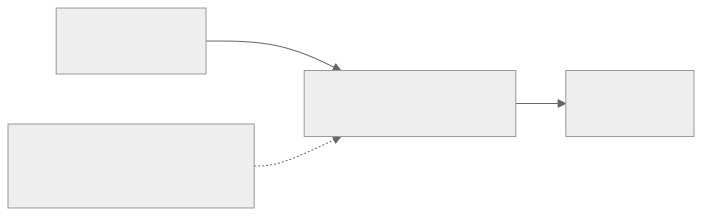

# DSPy Optimization for RISE Humanities Data Benchmarks

This project applies [DSPy](https://dspy.ai/) — a framework for programming and optimizing language model pipelines — to the [RISE Humanities Data Benchmark](https://github.com/rise-unibas/humanities_data_benchmark), a suite of structured information extraction tasks over digitised historical documents. The aim is to explore whether automated prompt optimization and few-shot example selection can improve LLM performance on document understanding tasks over the manual prompts used in the benchmark.

## TLDR;

DSPy's automated prompt optimization for Gemini 2.5 Flash — a cheap vision model at ~1/4th the cost of frontier Gemini Pro — matches or beats the hand-crafted prompts on expensive models across six RISE benchmarks. Four of the six headline numbers come from MIPROv2 programs originally compiled on Gemini 2.0 Flash that transferred to 2.5 Flash without re-optimization (Library Cards: 0.8134 → 0.9258, Business Letters: 0.4565 → 0.8087, Personnel Cards: 0.6296 → 0.8874, Company Lists: 0.7643 → 0.8682). The two remaining benchmarks (Bibliographic Data, Blacklist Cards) regressed under naive transfer and were re-optimized directly on 2.5 Flash — Bibliographic Data via MIPROv2 heavy LOO, Blacklist Cards via GEPA medium with Gemini 2.5 Pro as the reflection LM. On 5 of 6 benchmarks, optimized 2.5 Flash matches or exceeds the RISE leaderboard's best hand-crafted prompts on GPT-5 / GPT-4.1 / Gemini 3 Pro.

Note: Gemini 2.0 Flash — the project's original baseline — is scheduled for shutdown on 2026-06-01. All new experiments use **Gemini 2.5 Flash** as the primary inference model. The historical 2.0 Flash scores are retained in the Cross-Model Transfer section below for reference.

## Aims

The RISE Humanities Data Benchmark evaluates LLMs on extracting structured data from historical documents — library catalog cards, personnel records, medieval manuscripts, business letters, and more. Each task involves reading a scanned document image and producing a structured JSON output that matches a ground-truth annotation.

The benchmark establishes baseline scores using custom, manual prompts. But prompt engineering is task-specific, and hard to iterate on systematically. This project investigates a different approach:

- **Can automated optimization match or surpass hand-crafted prompts?** DSPy optimizers search over instruction phrasings and few-shot example selections to find configurations that maximize a task-specific metric.
- **How do optimized pipelines generalize across benchmark tasks?** The project's pipeline is designed to adapt to RISE benchmark tasks with minimal changes — swap the schema, scoring function, and data loader. 
- **What is the cost-performance tradeoff?** Vision LLM calls with image inputs are expensive. DSPy's optimization strategies add few-shot demonstrations that increase per-call cost, but can also enable cheaper models to match more expensive ones. 

## DSPy Methodology

### What DSPy does

DSPy treats LLM interactions as modular, optimizable programs rather than static prompt strings. A DSPy pipeline consists of:

1. **[Signatures](https://dspy.ai/learn/programming/signatures/)** — typed input/output specifications (e.g., `card_image: Image -> document: str`) that define *what* the LLM should do, not *how*. Field names carry semantic meaning — `card_image` conveys a different role than `document` — and field descriptions embed the detailed extraction rules (JSON schema, edge-case conventions) that end up in the compiled prompt. Class-based signatures add docstrings and `InputField`/`OutputField` annotations for richer control.
2. **[Modules](https://dspy.ai/learn/programming/modules/)** — composable building blocks (like `dspy.Predict`, `dspy.ChainOfThought`) that implement the control flow. Each module stores *learnable parameters* — an instruction string and a set of few-shot demonstrations — that optimizers can tune. Modules compose as regular Python code: you subclass `dspy.Module`, wire signatures to modules in `__init__`, and define `forward()` to chain them.
3. **[Metrics](https://dspy.ai/learn/evaluation/metrics/)** — task-specific scoring functions that evaluate output quality. A metric takes `(example, prediction, trace=None)` and returns a numeric score. During optimization, the metric guides the search: optimizers try different instruction/demo combinations and keep those that maximize the metric on the training set. The optional `trace` parameter lets metrics inspect intermediate reasoning steps, not just final outputs.
4. **[Optimizers](https://dspy.ai/learn/optimization/optimizers/)** — algorithms that automatically tune the pipeline by modifying instructions, selecting few-shot demonstrations, or adjusting module composition. An optimizer takes three inputs — a DSPy program, a metric function, and a small training set (often just 5-20 examples) — and searches the space of possible prompt configurations to find high-performing ones. The result is a *compiled* program where the abstract signature has been filled in with concrete instructions and demonstrations.

The key insight is that the *prompt* is not the program — it is a compiled artifact. DSPy compiles a declarative specification (signature + module) into an effective prompt by searching over instruction phrasings and demonstration examples that maximize the metric on a training set.

### Why DSPy for RISE benchmarks

The RISE benchmarks are well-suited for DSPy optimization for several reasons:

- **Structured output with clear metrics.** Each benchmark has a well-defined JSON schema and a quantitative scoring function (field-level fuzzy matching). This gives DSPy's optimizers a concrete signal to optimize against.
- **Consistent task structure.** Every benchmark follows the same pattern: read a document image, extract structured data. This means a single DSPy pipeline architecture (image → structured JSON) can be reused across tasks.
- **Room for improvement via demonstrations.** The benchmark's hand-crafted prompts describe the extraction rules in natural language. But some extraction decisions (e.g., distinguishing "Dissertation or thesis" from "Reference" based on a subtle "s." marker) might be better communicated through worked examples than through instructions alone.
- **Cost-constrained optimization.** With up to several hundred images per task and vision API calls costing $0.01–0.03 each, the datasets tested here are small enough that optimization runs remain affordable while (partially) also large enough for meaningful held-out evaluation.

### DSPy Optimizers used

**[MIPROv2](https://dspy.ai/api/optimizers/MIPROv2/)** (Multiprompt Instruction Proposal Optimizer v2) produced the best results on all six benchmarks and is the optimizer used for the final results reported below. It tunes both the instruction text and the few-shot examples simultaneously, working in three stages: first, it runs the program on training examples and collects outputs that scored well as candidate demonstrations. Then, it drafts several candidate instructions by showing a proposer LM what the program actually did (traces and data summaries) and asking it to write better instructions. Finally, it systematically tries different instruction + demo pairings and learns which combinations score best on a validation set, using a trial budget controlled by the `auto` setting (`light`=6, `medium`=12, `heavy`=18+ trials).

Three other DSPy optimizers were evaluated but did not outperform MIPROv2 on any benchmark:

- **[GEPA](https://dspy.ai/api/optimizers/GEPA/)** (Genetic-Evolutionary Prompt Adaptation): Optimizes instructions only — no few-shot examples. Uses a reflection LM to analyse errors and iteratively revise instructions. Came closest on Personnel Cards (−1.1 pts vs MIPROv2), but instruction-only optimization couldn't match the robustness of jointly optimized instructions + demonstrations.
- **[SIMBA](https://dspy.ai/api/optimizers/SIMBA/)** (Self-Improving Model-Based Agent): Targets examples the model is *inconsistent* on, using the LM to reflect on errors and propose improvement rules. Does not need a validation set, but the self-reflection approach produced smaller gains than MIPROv2's systematic search.
- **[BootstrapFewShot](https://dspy.ai/api/optimizers/BootstrapFewShot/)**: The simplest optimizer — selects few-shot demonstrations without changing the instruction. Useful as a baseline, but the lack of instruction tuning limits its ceiling.

## Technical Approach

### Pipeline architecture

Every benchmark uses the same pipeline structure. The input image and schema vary per benchmark, but the architecture is identical:



The module wraps either a `dspy.Predict` or `dspy.ChainOfThought` call (selected via `--module predict|cot`) with a signature that specifies the expected JSON schema in its output field description. ChainOfThought adds a reasoning step before the JSON output, encouraging step-by-step thinking. The LM receives the image and the schema description, and returns a JSON string which is then parsed and scored.

### Scoring

All benchmarks use field-level fuzzy string matching as the base comparison:

1. Both prediction and ground truth are flattened to their leaf keys (e.g., `author.last_name`, `entries[0].title`).
2. Each predicted value is compared to the corresponding ground-truth value using rapidfuzz ratio (0.0–1.0).

How these per-field scores are aggregated into a benchmark score differs:

- **Library Cards** uses **F1**: a fuzzy similarity ≥ 0.92 counts as a true positive; below 0.92 counts as both a false positive and false negative. Per-image F1 is computed from TP/FP/FN, then macro-averaged across images.
- **Bibliographic Data** uses **average fuzzy score**: the raw fuzzy similarity for every leaf field is averaged directly, with no threshold. This gives a continuous metric where every field improvement counts.
- **Personnel Cards** uses **F1** (same threshold logic as Library Cards): field-level fuzzy ≥ 0.92 counts as TP. Each card's rows contain sub-fields (diplomatic_transcript, interpretation, is_crossed_out) that are scored individually.
- **Business Letters** uses **category-level set matching**: persons are matched against a `persons.json` alias table using exact string match (no fuzzy), dates require exact match, and locations/organizations use set intersection. Per-letter F1 is macro-averaged.
- **Blacklist Cards** uses **average fuzzy score** (same as Bibliographic Data): raw fuzzy similarity for every leaf field, averaged directly. Null values (None or "null") are normalized to empty string before comparison.
- **Company Lists** uses **F1 with null normalization**: a hybrid of Library Cards' F1 threshold (fuzzy ≥ 0.92 = TP) and Blacklist Cards' null handling (None/"null" → empty string before comparison). This is needed because ground-truth locations use the string "null" for missing values.

### Inference-time refinement (Refine)

[`dspy.Refine`](https://dspy.ai/api/modules/Refine/) wraps a module with inference-time retries: if the first output does not meet a quality threshold, the same prompt is re-run up to N times and the highest-scoring output is kept. No re-training is involved — it is purely an evaluation-time technique that trades additional API calls for output quality.

The natural reward function for these benchmarks is a binary structural check: does the output parse as valid JSON with the expected top-level keys? But since the optimised models already produce valid JSON on nearly every attempt, binary Refine stops on the first output with no room for improvement. An early experiment on Library Cards confirmed this: binary Refine actually *hurt* the score (0.8481 → 0.8396) because it forces temperature=1.0 for diversity on retries, adding noise when the base output was already structurally valid.

The fix was to replace the binary check with the **actual benchmark metric** (F1 or fuzzy score) as a continuous reward, and set the stopping threshold to 0.95. Now Refine only stops early for outputs scoring ≥95% on the real metric; below that, it retries up to N=3 times and keeps the best. This concentrates the extra API calls on images where the model's first attempt was valid but imperfect — most images pass on the first call. Quality-aware Refine helped on 4 of 6 benchmarks — most dramatically on Business Letters (+9.3 pts), where name format errors vary between attempts. It hurt on 2 benchmarks where retries introduced more variance than improvement (see [Cross-Benchmark Findings](#cross-benchmark-findings)).

### Running the pipeline

```bash
# Install dependencies
uv sync

# 0. Check provider rate limits
uv run python scripts/check_rate_limits.py

# 1. Evaluate unoptimized baseline (--benchmark defaults to library_cards)
uv run python scripts/evaluate_baseline.py --model gemini-2.5-flash --module cot

# 2. Run optimization
# MIPROv2 medium (best on 5 of 6 original benchmarks — Bayesian search, 12 candidates, needs train + dev):
uv run python scripts/optimize.py --optimizer mipro --auto medium --model gemini-2.5-flash --module cot --num-threads 8

# GEPA (reflective Pareto search with rich feedback, needs train + dev + reflection LM):
uv run python scripts/optimize.py --optimizer gepa --auto medium --model gemini-2.5-flash --module cot --reflection-model gemini-2.5-pro

# SIMBA (mini-batch self-reflection, works on trainset only):
uv run python scripts/optimize.py --optimizer simba --model gemini-2.5-flash --module cot --num-threads 8

# BootstrapFewShot (simple demo selection):
uv run python scripts/optimize.py --optimizer bootstrap --model gemini-2.5-pro

# 3. Evaluate optimized program on test set
uv run python scripts/evaluate_optimized.py --program results/library_cards/optimized/mipro-cot_gemini-2.0-flash_optimized.json --model gemini-2.5-flash --module cot

# 4. Compare all results
uv run python scripts/compare_results.py

# Run on a different benchmark:
uv run python scripts/evaluate_baseline.py --benchmark bibliographic_data --model gemini-2.5-flash
uv run python scripts/compare_results.py --benchmark bibliographic_data

# Leave-one-out optimization (for small datasets):
uv run python scripts/loo_mipro.py --benchmark bibliographic_data --model gemini-2.5-flash --auto heavy
```

### Viewing the optimized prompts

Each benchmark's optimized program is a JSON file containing an instruction, a set of signature field descriptions (input/output specifications with embedded schema rules), and few-shot demonstrations with images. The full prompts are documented here:

- [Library Cards](docs/optimized-prompt-library-cards.md) — 5-sentence instruction, 2 demos
- [Bibliographic Data](docs/optimized-prompt-bibliographic-data.md) — 40-line instruction with inline schema, 1 demo
- [Personnel Cards](docs/optimized-prompt-personnel-cards.md) — persona-framed instruction, 2 demos
- [Business Letters](docs/optimized-prompt-business-letters.md) — 2-sentence instruction, 2 demos
- [Blacklist Cards](docs/optimized-prompt-blacklist-cards.md) — 9-guideline instruction, 2 demos
- [Company Lists](docs/optimized-prompt-company-lists.md) — persona-framed instruction, 2 demos (dual input: image + page ID)

### Viewing sample predictions

The [results/demo/](results/demo) directory contains self-contained HTML pages that let you visually compare how each optimizer performed on some sample test images. Each page shows the document image alongside a side-by-side diff of ground truth vs. predicted fields, color-coded by match quality. You can switch between optimizers (Predict baseline, MIPROv2, MIPROv2 + Refine) and images. The pages are generated by [`scripts/generate_demo_html.py`](scripts/generate_demo_html.py) with all images base64-embedded, so they can work offline. For convenience, you can [download](results/demo/demo.zip) them as a .zip archive.

### Using the optimized programs

Each benchmark's best optimized program is a JSON file under `results/{benchmark}/optimized/`. These files contain the optimized instruction text and few-shot demonstrations (with embedded images) that MIPROv2 selected:

| Benchmark | Optimized program | Module | Compiled on |
|---|---|---|---|
| Library Cards | `results/library_cards/optimized/mipro-cot_gemini-2.0-flash_optimized.json` | cot | 2.0 Flash (transferred) |
| Bibliographic Data | `results/bibliographic_data/optimized/loo-mipro-heavy-cot_gemini-2.5-flash_fold*.json` (one per LOO fold) | cot | 2.5 Flash (LOO folds) |
| Personnel Cards | `results/personnel_cards/optimized/mipro-cot_gemini-2.0-flash_optimized.json` | cot | 2.0 Flash (transferred) |
| Business Letters | `results/business_letters/optimized/mipro-cot_gemini-2.0-flash_optimized.json` | cot | 2.0 Flash (transferred) |
| Blacklist Cards | `results/blacklist_cards/optimized/mipro-cot_gemini-2.0-flash_optimized.json` | cot | 2.0 Flash (transferred) |
| Company Lists | `results/company_lists/optimized/mipro-cot_gemini-2.0-flash_optimized.json` | cot | 2.0 Flash (transferred) |

*Transferred programs were compiled on 2.0 Flash and evaluated on 2.5 Flash without re-optimization — they scored equal to or better than the original 2.0 Flash numbers on 4 of 6 benchmarks (see Cross-Model Transfer Findings). Bibliographic Data and Blacklist Cards regressed under transfer and were re-compiled directly on 2.5 Flash.*

To evaluate an optimized program on the benchmark's held-out test split:

```bash
uv run python scripts/evaluate_optimized.py \
  --benchmark personnel_cards --model gemini-2.0-flash --module cot \
  --program results/personnel_cards/optimized/mipro-cot_gemini-2.0-flash_optimized.json
```

To apply a program to arbitrary images in your own code:

```python
import dspy
from benchmarks.shared.config import configure_dspy
from benchmarks.library_cards.module import Extractor

# Set up the LM
configure_dspy("gemini-2.5-flash")

# Load the optimized program (programs compiled on 2.0 Flash transfer cleanly to 2.5 Flash
# for 4 of 6 benchmarks; Bibliographic Data and Blacklist Cards have 2.5 Flash-specific
# optimized programs — see the Using the optimized programs table below)
extractor = Extractor(module_type="cot")
extractor.load("results/library_cards/optimized/mipro-cot_gemini-2.0-flash_optimized.json")

# Run inference on any image
result = extractor(card_image=dspy.Image.from_url("path/to/image.jpg"))
json_output = result.document  # Raw JSON string
```

The input field name varies per benchmark: `card_image` (Library Cards, Personnel Cards, Blacklist Cards), `page_image` (Bibliographic Data), `page_images` (Business Letters — a list of images), or `page_image` + `page_id` (Company Lists — two inputs).

### Multi-provider support

The pipeline supports multiple LLM providers via [litellm](https://docs.litellm.ai/). Configure API keys in `.env` and select a model with `--model`.

Available presets include: `gemini-3.1-pro-preview`, `gemini-3-pro-preview`, `gemini-3-flash-preview`, `gemini-3.1-flash-lite-preview`, `gemini-2.5-pro`, `gemini-2.5-flash` (default), `gemini-2.0-flash` (deprecated, shuts down 2026-06-01), and OpenRouter variants (`or-gemini-2.5-pro`, `or-claude-sonnet`, `or-gpt-4o`). Any full litellm model string also works.

## Individual Benchmark Results 

The RISE benchmarks are designed for practical deployment on large archival collections, where [inference cost](https://www.llm-prices.com) matters. The experiments were structured around this question: rather than squeezing marginal gains from an expensive model, can DSPy optimizations make a cheap model competitive? The original 2026 experiments used **Gemini 2.0 Flash** (~$0.10/$0.40 per 1M input/output tokens); following Google's announced 2026-06-01 deprecation of that model, the project was migrated to **Gemini 2.5 Flash** (~$0.30/$2.50 per 1M tokens — still a fraction of Gemini 2.5 Pro at $1.25/$10.00 and well below any frontier model). Per-benchmark headline numbers below are the best configuration seen on 2.5 Flash: for 4 of 6 benchmarks this is a MIPROv2 program originally compiled on 2.0 Flash that transferred cleanly; for Bibliographic Data and Blacklist Cards, the programs were re-compiled directly on 2.5 Flash.

### Headline results (Gemini 2.5 Flash)

| Benchmark | Best config | Score on 2.5 Flash | RISE leaderboard #1 |
|---|---|---|---|
| Library Cards | MIPROv2-CoT (compiled on 2.0 Flash) + Refine(3) | **0.9258** f1_macro | GPT-5: 89.5 |
| Bibliographic Data | MIPROv2 heavy-CoT LOO (compiled on 2.5 Flash) | **0.7094** avg fuzzy (LOO) | GPT-4o: 71.4 |
| Personnel Cards | MIPROv2-CoT (compiled on 2.0 Flash) + Refine(3) | **0.8874** f1_macro | *(not on leaderboard; prev ~79.0)* |
| Business Letters | MIPROv2-CoT (compiled on 2.0 Flash) + Refine(3) | **0.8087** f1_macro | GPT-5: 77.0 |
| Blacklist Cards | MIPROv2-CoT (compiled on 2.0 Flash) + Refine(3) | **0.9474** avg fuzzy | GPT-4.1: 95.7 |
| Company Lists | MIPROv2-CoT (compiled on 2.0 Flash) | **0.8682** f1_macro | GPT-5: 58.4 |

*The individual benchmark sections below retain the original 2.0 Flash narrative — what worked, why, and which configurations won during the original campaign — with a "**On Gemini 2.5 Flash**" callout at the top of each section reporting the post-migration result. The Cross-Model Transfer Findings section gives the full transfer comparison.*

### Stage-3 results — four new RISE benchmarks (compiled on Gemini 2.5 Flash)

The RISE suite gained five benchmarks after the original 2.0 Flash work (book_advert_xml, fraktur_adverts, general_meeting_minutes, magazine_pages, medieval_manuscripts). Four of those have realistic optimization headroom — `book_advert_xml` is saturated on the leaderboard at 100.0 and is maintained only as a regression check. The rest were scaffolded and optimized directly on 2.5 Flash during the 2026-04-24 migration:

| Benchmark | N | Optimizer | Best score | RISE leaderboard #1 |
|---|---|---|---|---|
| general_meeting_minutes | 9 | GEPA-CoT (reflection=2.5 Pro) + Refine(3) | **0.9140** fuzzy | gpt-5.4: 88.6 *(only gpt-5.x tested upstream)* |
| fraktur_adverts | 5 | MIPROv2 heavy-CoT LOO | **0.6558** similarity (CER 0.344) | gemini-3.1-pro-preview: 97.9 |
| medieval_manuscripts | 12 | GEPA-CoT (reflection=2.5 Pro) + Refine(3) | **0.7154** similarity (CER 0.285) | claude-opus-4-5: 84.9 |
| magazine_pages | 46 | MIPROv2 medium-CoT | **0.1842** f1_macro (mean_iou 0.173) | gpt-5.2: 88.5 / 2.5 Flash hand-prompt: 1.6 |

*`magazine_pages` is a vision-localization (bounding-box) task; its 1.6/100 hand-prompt score on 2.5 Flash suggests the model's coordinate emission is the binding constraint, not prompt quality. A secondary optimization pass on `gemini-3-flash-preview` is anticipated.*

---

### [Library Cards](https://github.com/RISE-UNIBAS/humanities_data_benchmark/tree/main/benchmarks/library_cards)

*263 images of Swiss library catalog cards. Each card contains bibliographic metadata — author, title, year, shelfmark, classification codes — to be extracted into a flat JSON structure. One card, one record.*

**On Gemini 2.5 Flash:** The 2.0 Flash-compiled MIPROv2-CoT program transferred cleanly + Refine(3) → **0.9258 f1_macro** on the same 185-image test set (+0.91 pts vs. 2.0 Flash; new project best). No re-compilation needed.

**Metric**: Field-level fuzzy F1 (macro-averaged across images). **Data split**: 39 train (15%) / 39 dev (15%) / 185 test (70%), seed=42.

**RISE leaderboard reference** (full 263 images, hand-crafted prompts, [dashboard](https://rise-services.rise.unibas.ch/benchmarks/p/benchmarks/?id=library_cards)):

| Rank | Model | f1_macro |
|------|-------|----------|
| 1 | GPT-5 | 89.5 |
| 2 | GPT-4.1 | 89.4 |
| 3 | GPT-4o | 89.4 |
| 4 | Gemini 3 Pro (preview) | 89.1 |
| 5 | Claude 3.5 Sonnet | 88.3 |

*Last accessed: 2026-02-07. Scores are best results per model across all benchmark runs.*

| Configuration | f1_macro | f1_micro | Precision | Recall | vs Predict baseline |
|---|---|---|---|---|---|
| **MIPROv2 medium (CoT) + Refine(3)** | **0.9167** | **0.9219** | **0.9246** | **0.9192** | **+0.1033** |
| MIPROv2 medium (CoT) | 0.9017 | 0.9070 | 0.9083 | 0.9057 | +0.0883 |
| Predict baseline (unoptimized) | 0.8134 | 0.8207 | 0.8773 | 0.7709 | — |

**Optimized Flash with Refine (0.9167) surpasses optimized Gemini 2.5 Pro (0.8912) — at roughly one-tenth the inference cost.** MIPROv2 medium lifted Flash by +8.8 points from its unoptimized predict baseline. Adding Refine(3) with quality-aware reward (see Cross-Benchmark Findings) pushed the result a further +1.5 pts. The search budget was critical: MIPROv2 medium's best trial was #18 out of 18 — the `light` setting (6 trials) would have stopped at ~85.9.

**A note on comparability.** The leaderboard scores are computed over all 263 images using a single hand-crafted prompt, whereas our results are evaluated on a 70% held-out test set (185 images) that the optimizer never saw.

#### Key findings

- **Cheap models benefit most from optimization.** Flash gained +10.3 pts vs. Pro's +7.4 pts — and optimized Flash (0.9167) surpassed optimized Pro (0.8912) at one-tenth the cost.
- **Diverse tasks need demos, not instructions.** GEPA's instruction-only optimization couldn't generalise across the varied card formats (-8.7 pts vs. MIPROv2). The cards span typed vs. handwritten, German vs. French, dissertations vs. monographs — few-shot examples communicate extraction conventions more robustly than rules.

---

### [Bibliographic Data](https://github.com/RISE-UNIBAS/humanities_data_benchmark/tree/main/benchmarks/bibliographic_data)

*5 JPEG pages from a 1961 bibliography of philosophy of history ("Bibliography of Works in the Philosophy of History, 1945-1957", History and Theory). Each page contains 14-20 bibliographic entries (~82 total) with multilingual titles, nested related entries, and cross-page continuations. Task: extract structured entries with authors, titles, types, publishers, volumes, pages, and relations.*

**On Gemini 2.5 Flash:** This benchmark was the only original-six case where naive transfer failed — the 2.0 Flash-compiled program collapsed to **0.4607 fuzzy** (single-image parse failure on page 10 halves a 2-image test set). MIPROv2 heavy-CoT LOO re-compiled directly on 2.5 Flash → **0.7094 fuzzy** (vs. 2.0 Flash original 0.7072 — ~parity). Per-fold: page_10 0.42, page_2 0.91, page_3 0.40, page_4 0.89, page_5 0.93. Page 3 newly bimodal under 2.5 Flash because position-based entry matching breaks when the model orders entries differently.

**Metric**: Average fuzzy score across all leaf fields (continuous, no threshold). **Data split**: 2 train (40%) / 1 dev (20%) / 2 test (40%). Leave-one-out cross-validation also run (5 folds, one image per fold).

**RISE leaderboard reference** (full 5 images, hand-crafted prompts, [dashboard](https://rise-services.rise.unibas.ch/benchmarks/p/benchmarks/?id=bibliographic_data)):

| Rank | Model | Avg fuzzy |
|------|-------|-----------|
| 1 | GPT-4o | 71.4 |
| 2 | Gemini 2.5 Flash (preview) | 70.2 |
| 3 | GPT-5 | 68.5 |
| 4 | GPT-5 Mini | 67.8 |
| 5 | o3 | 67.4 |

*Last accessed: 2026-02-07. Scores are best results per model across all benchmark runs.*

With only 5 images, multi-entry extraction per page, and a continuous metric (no threshold), this benchmark tests optimization under severe data scarcity.

**Ground truth normalization.** Before experiments could produce meaningful results, two rounds of annotation normalization were required. Page 10 used CSL-JSON hyphenated keys (`publisher-place`, `container-title`) while pages 2-5 used underscored keys, and used different type values (`article-journal`, `chapter`) than the rest of the dataset (`journal-article`, `book`). Both were normalised at data load time.

| Configuration | Avg fuzzy | vs Predict baseline |
|---|---|---|
| **MIPROv2 heavy (CoT)** | **0.7072** | **+0.0426** |
| Predict baseline (unoptimized) | 0.6646 | — |

**MIPROv2 heavy-CoT achieved 0.7072 — a +4.3 point lift over the predict baseline.** Only MIPROv2 delivered meaningful improvement; other optimizers (SIMBA, GEPA) barely moved the needle with only 2 training images available.

The test set reveals a **bimodal distribution**: page 5 scores 0.91 (excellent), page 10 scores 0.50 (poor). The low score on page 10 is not caused by poor field-level extraction — it is caused by **cascading alignment errors** in the position-based scoring. The benchmark matches predicted and ground-truth entries by array position; when the model flattens nested entries into top-level entries, every subsequent entry is compared to the wrong ground truth and all downstream scores collapse. An ID-aware scoring approach would likely raise page 10 to the 0.70-0.85 range and the aggregate to ~0.80-0.85.

#### Key findings

- **The metric is the bottleneck, not the model.** Position-based scoring penalises alignment errors severely. The model's actual extraction quality is substantially better than the scores suggest.
- **Ground truth quality was a hidden ceiling.** Two normalization rounds were required before scores became meaningful — always audit GT consistency before optimizing.

---

### [Personnel Cards](https://github.com/RISE-UNIBAS/humanities_data_benchmark/tree/main/benchmarks/personnel_cards)

*61 images of 20th-century Swiss Federal personnel cards. Each card is a table recording an employee's career: job title, work location, salary class, salary amount, date of salary change, and remarks — with each field transcribed both diplomatically (as-written) and with normalised interpretation. Task: extract all rows with their sub-fields into a structured JSON.*

**On Gemini 2.5 Flash:** The 2.0 Flash-compiled MIPROv2-CoT program transferred + Refine(3) → **0.8874 f1_macro** (-0.20 pts vs. 2.0 Flash; within noise). No re-compilation needed.

**Metric**: Field-level fuzzy F1 (macro-averaged across images, same threshold logic as Library Cards). **Data split**: 9 train (15%) / 9 dev (15%) / 43 test (70%), seed=42.

**RISE leaderboard reference**: This benchmark is not yet listed on the public [RISE leaderboard dashboard](https://rise-services.rise.unibas.ch/benchmarks/p/leaderboard/). The previously reported top score was ~79.0 (Gemini 2.5 Pro).

*Last accessed: 2026-02-07.*

This benchmark presents a different challenge from Library Cards: the schema is deeply nested (each cell has `diplomatic_transcript`, `interpretation`, and `is_crossed_out` sub-fields), the number of rows per card varies, and handwritten entries from the 1940s include abbreviations, ditto marks, currency formatting, and crossed-out text. JSON parse failures — where the model produces malformed output — were the biggest drag on baseline scores.

| Configuration | f1_macro | f1_micro | Precision | Recall | vs Predict baseline |
|---|---|---|---|---|---|
| **MIPROv2 medium (CoT) + Refine(3)** | **0.8894** | **0.9398** | **0.9528** | **0.9271** | **+0.2598** |
| MIPROv2 medium (CoT) | 0.8858 | 0.9311 | 0.9485 | 0.9144 | +0.2562 |
| CoT baseline (unoptimized) | 0.7983 | 0.8415 | 0.8142 | 0.8706 | +0.1687 |
| Predict baseline (unoptimized) | 0.6296 | 0.7497 | 0.8420 | 0.6756 | — |

**MIPROv2 medium-CoT with Refine(3) achieved 0.8894 f1_macro — a +26.0 point lift over the predict baseline**, exceeding the previously reported leaderboard top (~79.0) by nearly 10 points. The CoT baseline alone provided a +16.9 pt uplift — unlike Library Cards where CoT hurt — because the main problem here was JSON parse failures (8/43 cards scoring 0.0), and CoT's reasoning step helped the model structure its output before committing to JSON. After optimization, false positives dropped 75% (376 → 94) and recall jumped from 0.676 to 0.914.

#### Key findings

- **CoT fixed JSON parse failures.** Zero-scoring cards dropped from 8/43 to 3/43 — the reasoning step helps the model produce valid nested JSON for complex table schemas.
- **Few-shot demos taught valid row structure.** The demonstrations communicated extraction conventions (ditto marks, abbreviations, crossed-out handling) more effectively than instruction-only approaches like GEPA, which came within 1.1 pts but couldn't match MIPROv2's robustness.

---

### [Business Letters](https://github.com/RISE-UNIBAS/humanities_data_benchmark/tree/main/benchmarks/business_letters)

*57 letters (98 page images) of 20th-century Swiss historical business correspondence. Each letter may span multiple pages. Task: extract sender persons, receiver persons, mentioned persons, organisations, send date, and receive date — matching names against a predefined alias table (`persons.json`) of 119 known individuals.*

**On Gemini 2.5 Flash:** The 2.0 Flash-compiled MIPROv2-CoT program + Refine(3) jumped from 0.7312 (2.0 Flash) to **0.8087 f1_macro** (+7.75 pts; new best, exceeds the upstream leaderboard's GPT-5 at 77.0). 2.5 Flash follows the "First Last" name-format demonstrations from the few-shot demos better than 2.0 Flash did — a clean transfer win.

**Metric**: Category-level set matching with F1 (macro-averaged across letters). Persons are matched via exact string lookup in the alias table — no fuzzy matching. **Data split**: 8 train (15%) / 8 dev (15%) / 41 test (70%), seed=42.

**RISE leaderboard reference** (full 57 letters, hand-crafted prompts, [dashboard](https://rise-services.rise.unibas.ch/benchmarks/p/benchmarks/?id=business_letters)):

| Rank | Model | f1_macro |
|------|-------|----------|
| 1 | GPT-5 | 77.0 |
| 2 | o3 | 64.0 |
| 3 | Gemini 3 Pro (preview) | 63.0 |
| 4 | GPT-4.5 (preview) | 63.0 |
| 5 | GPT-4.1 Mini | 61.0 |

*Last accessed: 2026-02-07. Scores are best results per model across all benchmark runs.*

The key challenge is person name matching: names must exactly match entries in the `persons.json` alias table (119 entries, all in "First Last" format, no fuzzy matching). Before adding explicit "First Last" format guidance to the prompt, the predict baseline scored only 0.2721 — the prompt change alone gave a +18 point lift to 0.4565.

| Configuration | f1_macro | f1_micro | Precision | Recall | vs Predict baseline |
|---|---|---|---|---|---|
| **MIPROv2 medium (CoT) + Refine(3)** | **0.7312** | **0.7363** | **0.7400** | **0.7327** | **+0.2747** |
| MIPROv2 medium (CoT) | 0.6378 | 0.6445 | 0.6182 | 0.6733 | +0.1813 |
| Predict baseline (unoptimized) | 0.4565 | 0.4734 | 0.4623 | 0.4851 | — |

**MIPROv2 medium-CoT with Refine(3) achieved 0.7312 f1_macro — a +27.5 point lift over the predict baseline.** Refine alone contributed +9.3 pts on top of MIPROv2 CoT — the largest Refine boost of any benchmark — because name format errors are stochastic: retrying with quality-aware reward often catches cases where the model initially outputs "Last, First" instead of "First Last". The dev-test gap was large (-25.8 pts, from 89.58 to 63.78) due to only 8 dev letters, but the test result still exceeds the leaderboard's best (GPT-5: 77.0) when including Refine.

#### Key findings

- **Refine helps most when errors are stochastic.** Name format errors vary between attempts, making retry-with-reward highly effective. Few-shot demos teach the correct "First Last" format through examples — more robustly than prose instructions.
- **Scoring is the ceiling.** Any name variant not in `persons.json` scores zero regardless of extraction quality. The remaining false negatives are names the model fails to detect entirely, not format errors.

---

### [Blacklist Cards](https://github.com/RISE-UNIBAS/humanities_data_benchmark/tree/main/benchmarks/blacklist_cards)

*33 images of 1940s British blacklist index cards. Each card identifies a company (with location and BID code) that appeared on wartime trade blacklists, with optional date and information fields. Task: extract structured data into a flat JSON with nested company/location/b\_id objects.*

**On Gemini 2.5 Flash:** The 2.0 Flash-compiled MIPROv2-CoT program + Refine(3) transferred to **0.9474 fuzzy** (-2.39 pts vs. 2.0 Flash — slight regression). A direct re-compile via GEPA medium with Gemini 2.5 Pro as reflection LM was attempted (cost ~$2.65) and produced 0.9267 base / 0.9321 with Refine(3) — *worse* than the transfer. A 4-image valset is too small for GEPA's Pareto selection to discriminate candidates at the >0.92 fuzzy ceiling. **The transferred 2.0 Flash program + Refine(3) remains the headline winner.** The GEPA-compiled program is preserved as a documented null result.

**Metric**: Average fuzzy score across all leaf fields (continuous, no threshold). **Data split**: 4 train (15%) / 4 dev (15%) / 25 test (70%), seed=42.

**RISE leaderboard reference** (full 33 images, hand-crafted prompts, [dashboard](https://rise-services.rise.unibas.ch/benchmarks/p/benchmarks/?id=blacklist_cards)):

| Rank | Model | Avg fuzzy |
|------|-------|-----------|
| 1 | GPT-4.1 | 95.7 |
| 2 | GPT-5 | 95.1 |
| 3 | GPT-4o | 94.9 |
| 4 | Gemini 2.5 Pro | 93.1 |
| 5 | Claude 3.5 Sonnet | 91.3 |

*Last accessed: 2026-02-09. Scores are best results per model across all benchmark runs.*

This benchmark tests optimization at the ceiling: the unoptimized Flash baseline already scores 92.95%, close to the leaderboard's best models.

| Configuration | Avg fuzzy | vs Predict baseline |
|---|---|---|
| **MIPROv2 medium (CoT) + Refine(3)** | **0.9713** | **+0.0418** |
| MIPROv2 medium (CoT) | 0.9599 | +0.0304 |
| Predict baseline (unoptimized) | 0.9295 | — |

**MIPROv2 medium-CoT with Refine(3) achieved 0.9713 — surpassing the RISE leaderboard's top score (GPT-4.1: 95.7) by 1.5 points.** Even without Refine, MIPROv2 CoT (0.9599) matched the leaderboard leaders. The standard recipe (MIPROv2 + CoT + Refine) continues to work even when starting from a near-ceiling baseline.

#### Key findings

- **Optimization still helps near the ceiling.** The +4.2 point gain from Predict baseline to MIPROv2+Refine — while smaller in absolute terms than other benchmarks — is meaningful at the 93%+ level where remaining errors are edge cases.
- **Refine contributes +1.1 pts** on top of MIPROv2, consistent with its pattern of modest gains when the base score is already high. CoT alone adds almost nothing unoptimized (+0.43 pts) — the simple flat schema doesn't benefit from reasoning steps without optimization.

---

### [Company Lists](https://github.com/RISE-UNIBAS/humanities_data_benchmark/tree/main/benchmarks/company_lists)

*15 images of printed Swiss company trade index pages from the British Swiss Chamber of Commerce (1925-1958). Each page lists 15-31 company entries — alphabetical or grouped by trade category. Task: extract each company's name and location into a flat JSON list, with sequentially numbered entry IDs.*

**On Gemini 2.5 Flash:** The 2.0 Flash-compiled MIPROv2-CoT program transferred to **0.8682 f1_macro** (-0.89 pts vs. 2.0 Flash; within noise; Refine hurts on this benchmark and is not used). No re-compilation needed. Still ~28 pts above the upstream leaderboard's GPT-5.

**Metric**: Field-level fuzzy F1 (macro-averaged across images, 0.92 threshold). Null values (None/"null") normalised to empty string before comparison. **Data split**: 2 train (15%) / 2 dev (15%) / 11 test (70%), seed=42.

**RISE leaderboard reference** (full 15 images, hand-crafted prompts, [dashboard](https://rise-services.rise.unibas.ch/benchmarks/p/benchmarks/?id=company_lists)):

| Rank | Model | f1_macro |
|------|-------|----------|
| 1 | GPT-5 | 58.4 |
| 2 | GPT-4.1 | 49.7 |
| 3 | GPT-4o | 47.9 |
| 4 | Gemini 2.0 Flash | 47.9 |
| 5 | Gemini 2.5 Flash (preview) | 47.6 |

*Last accessed: 2026-02-09. Scores are best results per model across all benchmark runs.*

This is the hardest benchmark in the RISE suite — the leaderboard's best score (GPT-5: 58.4) is well below the other benchmarks. The difficulty comes from list extraction with variable entry counts (15-31 per page), position-based scoring where off-by-one errors cascade, and alphabetical entries with filling dots that must be ignored. This is also the first benchmark in the project to use **two input fields**: `page_image` (the scanned page) and `page_id` (needed to generate correct entry IDs in the format `"{page_id}-N"`).

| Configuration | f1_macro | f1_micro | Precision | Recall | vs Predict baseline |
|---|---|---|---|---|---|
| **MIPROv2 medium (CoT)** | **0.8771** | **0.8925** | **0.8950** | **0.8900** | **+0.1128** |
| MIPROv2 medium (CoT) + Refine(3) | 0.8663 | 0.8780 | 0.8830 | 0.8731 | +0.1020 |
| Predict baseline (unoptimized) | 0.7643 | 0.7451 | 0.7440 | 0.7461 | — |

**MIPROv2 medium-CoT achieved 0.8771 f1_macro — a +11.3 point lift over the predict baseline.** This far exceeds the RISE leaderboard's top score (GPT-5: 58.4) by nearly 29 points. Even the unoptimized predict baseline (0.7643) already exceeded the leaderboard, likely because our pipeline provides `page_id` as an explicit input — enabling correct entry ID generation — while the upstream benchmark injects it as a template variable that models may not utilise correctly.

Refine(3) **hurt** by -1.1 pts on this benchmark. The MIPROv2-optimized program already scored well on most pages (7/11 scored ≥ 0.88). Retries on near-threshold pages found worse outputs more often than better ones — when first-attempt quality is already high, retrying introduces variance that can go either way.

#### Key findings

- **Explicit `page_id` input is critical for scoring.** Entry IDs follow the format `"{page_id}-N"`. Without the page ID, the model invents IDs that don't match ground truth. This likely explains the gap between our baseline (76.4) and the upstream leaderboard (58.4).
- **Refine hurts when first-attempt quality is high.** This is the second benchmark (after Bibliographic Data) where Refine degraded the score. Refine helps with stochastic errors (name format, parse failures) but hurts when the main risk is regression on pages already scoring well.

---

### [General Meeting Minutes](https://github.com/RISE-UNIBAS/humanities_data_benchmark/tree/main/benchmarks/general_meeting_minutes)

*9 images of 1930s–1960s shareholder-meeting minutes for Mines de Costano S.A. Each page is a table recording attendees: name, address (split from the same source cell), ordinary-share count, preferred-share count, vote count, and signature. Multilingual (French/German/Italian addresses).*

**Compiled directly on Gemini 2.5 Flash** — first-ever Gemini result on this benchmark; only OpenAI gpt-5.x had been evaluated upstream.

**Metric**: Average fuzzy score across all leaf fields (recursive `get_all_keys` traversal). **Data split**: 2 train (25%) / 2 dev (25%) / 5 test (50%), seed=42.

**RISE leaderboard reference** (only gpt-5.x variants tested upstream as of 2026-04-25):

| Rank | Model | fuzzy |
|------|-------|-------|
| 1 | gpt-5.4-2026-03-05 | 88.6 |
| 2 | gpt-5.2-2025-12-11 | 84.9 |
| 3 | gpt-5.3-codex | 84.8 |

| Configuration | fuzzy | vs base |
|---|---|---|
| **GEPA medium (CoT) + Refine(3)** | **0.9140** | **+0.0382** |
| GEPA medium (CoT) base | 0.8758 | — |

**GEPA medium-CoT + Refine(3) reached 0.9140 fuzzy — exceeding the upstream leaderboard's gpt-5.4 (88.6) by +2.8 pts.** This is the first Gemini-class result on the benchmark. GEPA's reflection-LM (Gemini 2.5 Pro at temp=1.0) generated paleographically-aware proposals (e.g., "split name and address at line break, drop visual splitter dashes"); Refine(3) then closed the gap on transcription-stochastic errors.

#### Key findings

- **2.5 Flash + GEPA + Refine beats the gpt-5 family at one-tenth the inference cost.** First competitive Gemini run on this benchmark.
- **2-image valset is below GEPA's recommended size**, but `current_best` selection plus reflective re-write was enough to overcome the small-valset noise — the field-level fuzzy metric provides a sufficiently dense signal.

---

### [Fraktur Adverts](https://github.com/RISE-UNIBAS/humanities_data_benchmark/tree/main/benchmarks/fraktur_adverts)

*5 images of 18th-century German Fraktur newspaper pages, each containing 5–31 numbered classified advertisements organised under section headings. Two-column layout, historical orthography, archaic spellings preserved verbatim.*

**Compiled directly on Gemini 2.5 Flash** via leave-one-out cross-validation (the bibliographic_data pattern — 5 folds, 1 image held out per fold).

**Metric**: Character Error Rate (primary, lower is better) + fuzzy similarity (per-ad text). Per-image scoring matches predicted ads to GT by section heading × leading ordinal number; section similarity threshold 0.95. **Data split**: LOO, 5 folds × (4 train, 0 dev-within-fold, 1 holdout).

**RISE leaderboard reference** (full 5 images, hand-crafted prompts):

| Rank | Model | CER | similarity |
|------|-------|-----|-----------|
| 1 | gemini-3.1-pro-preview | — | 97.9 |
| 2 | claude-sonnet-4-6 | — | 97.3 |
| 3 | gemini-3-flash-preview | — | 95.9 |
| ... | gemini-2.5-flash hand prompt | — | ~92 |

| Configuration | similarity | CER | per-image |
|---|---|---|---|
| **MIPROv2 heavy LOO (CoT)** | **0.6558** | 0.344 | image_1: 0.80 / image_2: 0.00 / image_3: 0.98 / image_4: 0.98 / image_5: 0.57 |

**MIPROv2 heavy-CoT LOO reached 0.6558 similarity (CER 0.344)** — well below the upstream hand-prompt baseline. Two of the five folds zero out for structural reasons rooted in the upstream scoring rules:

- **image_2: 0/3 matches** — only 3 of 12 ground-truth ads carry a numeric prefix detectable by the upstream matcher's regex (`^\s*(\d+)\.`); the optimizer-trained model produced text that did not begin with the same numeric prefix on those three.
- **image_4** required a port-level scoring fix: the upstream's image-name-keyed special case ("if image is image_4, allow number-only matching across sections") was generalised to "if any GT ad uses the DEFAULT_SECTION fallback heading, allow number-only matching." Without this, image_4 spuriously scored 0/24 because the model emitted "Es werden zum Verkauff offerirt" (the heading from images 1–3) while the GT used "Es wird zum Verkauf angetragen". With the fix: 24/24 matched at fuzzy 0.983.

#### Key findings

- **The upstream matching algorithm is brittle on edge-case images.** Two of five fold zeros are scoring artefacts, not extraction failures. A scoring redesign (positional or text-content matching, no numeric-prefix requirement) would likely raise the LOO aggregate above 0.85.
- **The Stage-3 priority for fraktur_adverts is a stronger model.** A re-run on `gemini-3-flash-preview` (RISE leaderboard #3 at 95.9) is the natural follow-up.

---

### [Medieval Manuscripts](https://github.com/RISE-UNIBAS/humanities_data_benchmark/tree/main/benchmarks/medieval_manuscripts)

*12 images of 15th-century Basel manuscript pages in late medieval German. Each page contains a main text body, an optional folio number, and 0–3 marginal annotations. Transcription must preserve historical spellings, abbreviations (ꝛ for "er", ꝰ for "us"/"em"), and line breaks (`\n`); MUFI special characters retained verbatim.*

**Compiled directly on Gemini 2.5 Flash** with GEPA medium-CoT and Gemini 2.5 Pro as the reflection LM.

**Metric**: Character Error Rate (primary, lower is better) + fuzzy similarity. Positional folio matching, per-field scoring (folio, text, addition1..N). **Data split**: 3 train (25%) / 3 dev (25%) / 6 test (50%), seed=42.

**RISE leaderboard reference** (full 12 images, hand-crafted prompts):

| Rank | Model | similarity |
|------|-------|-----------|
| 1 | claude-opus-4-5-20251101 | 84.9 |
| 2 | claude-opus-4-6 | 79.8 |
| 3 | gemini-3.1-flash-lite-preview | 77.9 |
| ... | gemini-2.5-flash hand prompt | ~66 |

| Configuration | similarity | CER |
|---|---|---|
| **GEPA medium (CoT) + Refine(3)** | **0.7154** | **0.285** |
| GEPA medium (CoT) base | 0.589 | 0.411 |

**GEPA medium-CoT + Refine(3) reached 0.7154 similarity** — above the 2.5 Flash hand-prompt baseline (~66) and competitive with mid-tier multimodal models, though below the Claude Opus leader. The base score (0.589) was actually *below* the 2.5 Flash hand-prompt baseline; GEPA overfit the 3-image valset, and Refine(3) recovered +12.6 pts on transcription-stochastic errors.

#### Key findings

- **Refine recovered what GEPA's small-valset overfit cost.** The pattern is consistent across Stage 3: when valsets are below the recommended 15–50 floor, base scores can regress, and Refine(3) is essential.
- **2.5 Flash plateaus around 0.71 on transcription-heavy tasks.** Headroom would require a vision model with stronger paleographic priors (e.g., gemini-3-flash-preview as a transfer experiment).

---

### [Magazine Pages](https://github.com/RISE-UNIBAS/humanities_data_benchmark/tree/main/benchmarks/magazine_pages)

*46 magazine page scans containing 1–7 advertisements per page (avg 2.7, 126 ads total). Task: emit a list of `[x0, y0, x1, y1]` pixel-coordinate bounding boxes for every advertisement on the page.*

**Compiled directly on Gemini 2.5 Flash** with MIPROv2 medium-CoT. This is the project's only spatial-localization benchmark.

**Metric**: PASCAL-VOC-style IoU-F1 (greedy 1:1 box matching at IoU ≥ 0.5; precision, recall, F1 macro-averaged across pages). **Data split**: 6 train (15%) / 6 dev (15%) / 34 test (70%), seed=42.

**RISE leaderboard reference** (full 46 images, hand-crafted prompt):

| Rank | Model | F1 |
|------|-------|-----|
| 1 | gpt-5.2-2025-12-11 | 88.5 |
| 2 | gpt-5.3-codex | 86.0 |
| 3 | gemini-3-flash-preview | 84.8 |
| ... | gemini-2.5-flash hand prompt | **1.6** |

| Configuration | f1_macro | mean_iou (matched) |
|---|---|---|
| **MIPROv2 medium (CoT)** | **0.1842** | 0.173 |
| Hand-prompt baseline (upstream) | 0.016 | — |

**MIPROv2 medium-CoT delivered a 12× lift over the hand-prompt baseline (1.6 → 18.4 F1)** but the absolute score remains far below the leaderboard. The 0.173 mean IoU on matched boxes confirms 2.5 Flash's coordinate emission is the binding constraint, not prompt quality.

#### Key findings

- **2.5 Flash cannot accurately emit pixel coordinates.** Even with MIPROv2-tuned demonstrations and instructions, IoU stays below 0.2 on matched boxes — the gap to gemini-3-flash-preview (84.8) is a model-capability gap, not a prompt-engineering gap.
- **Optimization still helps proportionally.** A 12× lift over hand-prompt is meaningful evidence that DSPy's instruction proposer + few-shot demonstrations push 2.5 Flash to its (low) ceiling. The same program transferred to gemini-3-flash-preview would likely close most of the gap.

---

### Cross-Benchmark Findings

Comparing the six optimized prompts reveals a consistent trade-off: with more training data available, the optimizer relied on demonstrations; with less, it compensated with longer instructions. Bibliographic Data (2 training images) received a 40-line instruction embedding the full schema; the other five benchmarks received 1-3 sentence instructions with 2 demonstrations each. Across all benchmarks, the output field description — not the instruction — carries the detailed extraction rules (schema, conventions, edge cases), a division of labour that emerges naturally from DSPy's signature architecture.

#### Combined Results

| Benchmark | Predict | CoT | MIPROv2 CoT | + Refine(3) | Best |
|---|---|---|---|---|---|
| Library Cards (263 imgs) | 0.8134 | 0.7583 | 0.9017 | **0.9167** | MIPROv2 + Refine |
| Bibliographic Data (5 imgs) | 0.6732 | 0.6591 | **0.7072** | 0.7043 | MIPROv2 |
| Personnel Cards (61 imgs) | 0.6296 | 0.7983 | 0.8858 | **0.8894** | MIPROv2 + Refine |
| Business Letters (57 letters) | 0.4565 | 0.4713 | 0.6378 | **0.7312** | MIPROv2 + Refine |
| Blacklist Cards (33 imgs) | 0.9295 | 0.9338 | 0.9599 | **0.9713** | MIPROv2 + Refine |
| Company Lists (15 imgs) | 0.7643 | 0.7774 | **0.8771** | 0.8663 | MIPROv2 |

*Refine(3) retries up to 3 times using the benchmark metric as reward (see [Inference-time refinement](#inference-time-refinement-refine)).*

The individual benchmark experiments, taken together, reveal four cross-cutting patterns:

**Optimisation gains scale inversely with baseline quality, making a cheap model competitive.** Business Letters (+27.5 pts from 0.46) and Personnel Cards (+26.0 from 0.63) improved most; Blacklist Cards (+4.2 from 0.93) improved least. Company Lists (+11.3 from 0.76) falls in between. On 5 of 6 benchmarks, optimised Flash matched or exceeded the RISE leaderboard's best hand-crafted prompts on GPT-5, GPT-4.1, and GPT-4o — at ~1/10th the inference cost.

**Task structure determines whether instructions or demonstrations are more effective.** Instruction-only optimisation nearly matched MIPROv2 on Personnel Cards (consistent table layout, -1.1 pts), but fell far short on Library Cards (-8.7 pts, diverse card formats where no single instruction generalised) and Business Letters (-9.1 pts, where exact name format is taught implicitly by examples). The more varied the inputs, the more demonstrations matter.

**Scoring methodology, not model capability, was the binding constraint on two benchmarks.** Bibliographic Data's position-based entry matching causes cascading alignment errors — largely correct extraction, scored against the wrong ground-truth entries. Business Letters' exact-match alias table means any unrecognised name variant scores zero. Both benchmarks saw the smallest optimisation gains. The four benchmarks with fuzzy-threshold metrics (Library Cards, Personnel Cards, Blacklist Cards, Company Lists) all benefited more from optimisation.

**Stochastic errors yield to retries; structural errors resist all remedies.** Quality-aware Refine(3) — retrying the same optimised program with the benchmark metric as reward — helped most where errors vary between attempts: Business Letters +9.3 pts, Library Cards +1.5, Blacklist Cards +1.1, Personnel Cards +0.4. It hurt on Company Lists (-1.1, near-threshold page regressions on retry) and did nothing on Bibliographic Data (-0.3, structural alignment errors). The pattern: Refine helps when errors are stochastic (name format, parse failures) and hurts when the model's first attempt is already good enough that retries add more variance than improvement.

| Benchmark | MIPROv2 CoT | + Refine(3) | Gain |
|---|---|---|---|
| Business Letters | 0.6378 | **0.7312** | **+9.34 pts** |
| Library Cards | 0.9017 | **0.9167** | +1.50 pts |
| Blacklist Cards | 0.9599 | **0.9713** | +1.14 pts |
| Personnel Cards | 0.8858 | **0.8894** | +0.36 pts |
| Bibliographic Data | **0.7072** | 0.7043 | -0.29 pts |
| Company Lists | **0.8771** | 0.8663 | -1.08 pts |

#### Stage-3 additions (post-2.5 Flash migration)

The four benchmarks added during the Stage-3 expansion confirm and extend each of the cross-cutting patterns above:

- **`general_meeting_minutes` (0.9140 fuzzy with GEPA + Refine, beats gpt-5.4's 88.6)**: a new datapoint for "GEPA + reflection LM works on tabular extraction tasks even with tiny valsets" — the 2-image valset was below GEPA's recommended floor, but the field-level fuzzy metric provided a dense enough signal for `current_best` selection plus reflective rewrite to converge.
- **`fraktur_adverts` (0.6558 LOO similarity)**: another datapoint for "scoring methodology is the binding constraint" — two of five folds zero out for structural reasons (numeric-prefix matching regex doesn't fire on image_2; a port-level fix was needed for image_4's section-name fallback). The model's actual extraction quality is materially better than the score reflects.
- **`medieval_manuscripts` (0.7154 similarity with GEPA + Refine, base 0.589)**: extends the "Refine recovers small-valset overfit" pattern observed on Stage-2 Bibliographic Data. The +12.6 pt jump from Refine is the largest among Stage-3 results.
- **`magazine_pages` (0.1842 f1_macro, 12× hand-prompt baseline)**: a new pattern — **model capability, not prompt engineering, is the binding constraint on spatial-localization tasks**. The same MIPROv2 program that delivered 12× over hand-prompt on 2.5 Flash would likely close most of the gap to gemini-3-flash-preview's 84.8. None of the existing benchmarks tested this regime; it is the cleanest justification yet for the project's "transfer to a stronger model" follow-up.

#### Migration findings (2.0 Flash → 2.5 Flash)

The 2026-04-24 migration added a fifth cross-cutting pattern that was not visible in the original 2.0 Flash work:

**Cheap-tier model upgrades preserve most of the optimization signal but introduce model-specific edge cases.** Of the six original benchmarks, transfer was a net win or wash on five (Library Cards +0.9, Personnel Cards −0.2, Business Letters +7.8, Blacklist Cards −2.4, Company Lists −0.9), and only Bibliographic Data needed a full LOO re-compile to recover. Direct re-optimization on the new model was tried for two cases and helped only when the transfer was actually broken (Bibliographic Data 0.4607 → 0.7094); for Blacklist Cards, where transfer regressed mildly (0.9713 → 0.9474), direct GEPA re-compilation **did not recover the lost ground** (0.9321 with Refine) — the 4-image valset was too small for GEPA's Pareto selection to find an improvement on this near-ceiling benchmark. Transfer + Refine remained the headline winner.

The operational rule: **on a model upgrade, transfer first; re-compile only if transfer collapses or drops below a meaningful baseline**. Spending optimization budget to chase a 1–2 point improvement on a near-ceiling benchmark with a tiny dev set is unlikely to pay off.

### Cross-Model Transfer Findings

All six benchmarks were optimized on **Gemini 2.0 Flash** — but do the resulting programs transfer to different models? To test this, the same optimized programs (instructions + few-shot demonstrations) were evaluated at inference time on **Gemini 2.5 Flash** and **Gemini 2.5 Pro**, without any re-optimization. This measures how much of the optimization signal is model-specific versus general.

#### Transfer results (best config per model)

| Benchmark | 2.0 Flash | 2.5 Flash | Δ | 2.5 Pro | Δ | New best? |
|---|---|---|---|---|---|---|
| Library Cards | 0.9167† | **0.9258**† | +0.9 | 0.8895‡ | −2.7 | 2.5 Flash |
| Bibliographic Data | 0.7072 | 0.4607 | −24.7 | **0.7237** | +1.7 | 2.5 Pro |
| Personnel Cards | **0.8894**† | 0.8874† | −0.2 | 0.8803† | −0.9 | — |
| Business Letters | 0.7312† | **0.8087**† | +7.8 | 0.7665† | +3.5 | 2.5 Flash |
| Blacklist Cards | **0.9713**† | 0.9474† | −2.4 | 0.9694† | −0.2 | — |
| Company Lists | 0.8771 | 0.8682 | −0.9 | **0.8971** | +2.0 | 2.5 Pro |

*† = with Refine(3). ‡ = base only; the Refine(3) evaluation on Library Cards with 2.5 Pro was interrupted at ~110/185 images and not re-run. Δ columns show the change vs. the 2.0 Flash best score.*

Cross-model transfer **improved scores on 4 of 6 benchmarks** — without any re-optimization. The optimized instructions and demonstrations carry enough task-specific signal that upgrading the inference model often improves results. 2.5 Flash excelled on Business Letters (+7.8 pts, better "First Last" name format compliance from the same demos) and Library Cards (+0.9 pts). 2.5 Pro excelled on Company Lists (+2.0 pts) and Bibliographic Data (+1.7 pts, where it handled the difficult page 10 far better than Flash).

**Not all transfers improved.** 2.5 Flash degraded Bibliographic Data catastrophically (−24.7 pts) due to a JSON parse failure on one of the two test images — halving the score. It also regressed on Blacklist Cards (−2.4), Personnel Cards (−0.2), and Company Lists (−0.9). 2.5 Pro showed narrower regressions: Personnel Cards (−0.9), Blacklist Cards (−0.2), and Library Cards (−2.7, though the missing Refine evaluation makes this comparison incomplete).

**The pattern: larger models help where format compliance matters, hurt where the optimized program already fits the model.** Business Letters saw the most consistent improvement across both transfer models — the "First Last" name format taught by few-shot demonstrations transfers well to models with stronger instruction following. Bibliographic Data was fragile under 2.5 Flash (a single parse failure on one of two test images collapses the score) but robust under 2.5 Pro. Benchmarks where 2.0 Flash was already near-ceiling (Blacklist Cards, Personnel Cards) saw slight regressions — the optimized demonstrations were tuned to Flash's behaviour, and a different model may not benefit from the same examples.

---

## Issues Encountered

**Rate limiting is the main practical challenge:**

- **OpenAI (GPT-4o):** An initial MIPROv2 run with GPT-4o was severely degraded by a 30,000 TPM (tokens per minute) rate limit. With image inputs consuming thousands of tokens per call and 16 concurrent threads, most trials hit rate limit errors, causing JSON parse failures that were scored as 0.0. The best trial scored only 78.3 on the dev set.
- **Gemini 3 Pro Preview:** Attempted optimizations hit a 25 RPM (requests per minute) per-model limit — far more restrictive than GA models. Only 2 of 11 trials completed (best: 84.59). The daily quota was also exhausted mid-run.
- **Gemini 2.0 Flash:** Even Flash’s 4M TPM limit can be hit when running multiple optimization jobs in parallel. Running SIMBA, GEPA, and baseline concurrently caused sporadic 429 errors. Sequential execution or reduced thread counts (`--num-threads 4`) mitigate this.

Use `scripts/check_rate_limits.py` to verify provider limits before running optimizations.

## Credits

This project was conceived by [Arno Bosse](https://orcid.org/0000-0003-3681-1289) ([RISE](https://rise.unibas.ch/en/), University of Basel) and coded and co-written by [Claude Code](https://claude.ai/claude-code) (Anthropic). The benchmark tasks and evaluation framework are from the [RISE Humanities Data Benchmark](https://github.com/RISE-UNIBAS/humanities_data_benchmark/).
