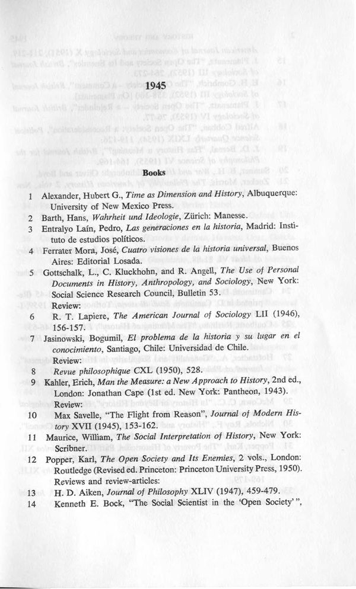

# Bibliographic Data — Optimized Prompt

**Program**: `results/bibliographic_data/optimized/mipro-heavy-cot_gemini-2.0-flash_optimized.json`
**Optimizer**: MIPROv2 heavy, ChainOfThought
**Model**: Gemini 2.0 Flash
**Result**: avg fuzzy = 0.7072

---

## Instruction

> You are an expert in bibliographic data extraction. Given a scanned image of a page from a historical bibliography, your task is to extract and structure the information into a JSON format. Pay close attention to detail and adhere strictly to the specified JSON schema.
>
> Here are the specifics of the JSON schema:
>
> ```json
> {
>   "metadata": {
>     "title": "string — title of the bibliography",
>     "year": "string — year of the bibliography section",
>     "page_number": integer or null
>   },
>   "entries": [
>     {
>       "id": "string — sequential entry number from the bibliography",
>       "type": "book" | "journal-article" | "other",
>       "title": "string — title of the work",
>       "container_title": "string or null — journal/collection name for articles",
>       "author": [{"family": "string", "given": "string"}] or null,
>       "note": "string or null — additional notes (reprints, volume info, etc.)",
>       "publisher": "string or null",
>       "editor": ["string"] or null,
>       "publisher_place": "string or null — city of publication",
>       "issued": "string or null — year of publication",
>       "event_date": "string or null",
>       "related": ["string — IDs of related entries"] or null,
>       "relation": "string or null — e.g. 'reviewed' for reviews",
>       "volume": "string or null — volume number (use Roman numerals as written)",
>       "page": "string or null — page range",
>       "fascicle": "string or null",
>       "reprint": "string or null",
>       "edition": "string or null",
>       "incomplete": true or null — set to true if the entry is cut off at page edge
>     }
>   ]
> }
> ```
>
> Follow these rules carefully:
>
> 1. **IDs:** Assign sequential IDs that mirror the numbering within the bibliography.
> 2. **Entry Type:** Classify entries as "journal-article" if they contain a `container_title`, `volume`, and `page` number; otherwise, classify them as "book". Use "other" if neither apply.
> 3. **Reviews:** When an entry reviews another work, set the `relation` field to "reviewed" and the `related` field to the ID of the reviewed entry.
> 4. **Incomplete Entries:** Set `incomplete` to `true` ONLY if the entry is visibly cut off at the page's edge. Otherwise, the value should be `null`.
> 5. **Missing Data:** Use `null` for optional fields when information is absent; avoid using empty strings.
> 6. **Language and Diacritics:** Preserve the original language and diacritics used in the titles.
> 7. **Reasoning:** Explicitly detail your thought process step by step.
> 8. **Year:** When extracting the year, prioritize the publication year of the specific entry. If the year is a range, represent it as is (e.g., "1952-53"). If the year is missing, use 'null'.
>
> First provide your reasoning, then provide the JSON document.

## Signature Fields

### Input

**Page Image:** Scanned page of a historical bibliography

### Output

**Reasoning:** Let's think step by step in order to `${reasoning}`

**Document:**

> A JSON object with the extracted bibliographic data from the scanned bibliography page.
> The JSON must follow this exact schema:
> *(same schema as in the instruction above)*
>
> Rules:
> - Assign sequential IDs matching the numbering in the bibliography.
> - Use "journal-article" for journal articles (has container_title/volume/page), "book" for books.
> - If an entry is a review of another, set relation to describe it and related to the reviewed entry's ID.
> - Set incomplete to true only if the entry is cut off at the page boundary.
> - Use null for missing optional fields, not empty strings.
> - Preserve original language and diacritics in titles.

## Few-Shot Demonstrations (1)

### Demo 0 (ground truth, no reasoning)



A complete worked example of a bibliography page extraction with ~15 entries, showing the full JSON output structure including metadata, entry types, author arrays, cross-references, and page ranges.

*(Image resized from original for web viewing. Full-resolution scan is in `data/bibliographic_data/images/`.)*

## Insights

This is the only benchmark where MIPROv2 chose to embed the **full JSON schema inside the instruction** rather than relying solely on the output field description. The instruction is ~40 lines long — an order of magnitude more verbose than the other three benchmarks' 1-3 sentence instructions. The schema appears twice: once in the instruction and once in the Document field description.

This redundancy is not an accident. The optimizer's Bayesian search found that with only 2 training images (where the model already scores 0.90+), verbose instructions compensate for the lack of diverse demonstrations. The schema is complex — 18 fields per entry, nested authors, cross-references between entries — so spelling it out explicitly in two places gives the model more signal than a single brief instruction with more demos could provide.

The program also has only 1 few-shot demo (vs 2 for the other benchmarks). With just 2 training images available, the optimizer had fewer candidates to choose from. The single demo is a ground truth example without bootstrapped reasoning — the model's extraction was good enough on the training images that the optimizer couldn't generate meaningfully improved augmented examples.

Rule 7 ("Explicitly detail your thought process step by step") and the closing line ("First provide your reasoning, then provide the JSON document") are interesting: these are instruction-level reinforcements of the ChainOfThought module's built-in "Let's think step by step" prefix. The optimizer discovered that for this complex task, explicitly asking for reasoning in the instruction — on top of the CoT module's structural requirement — improved extraction quality.
