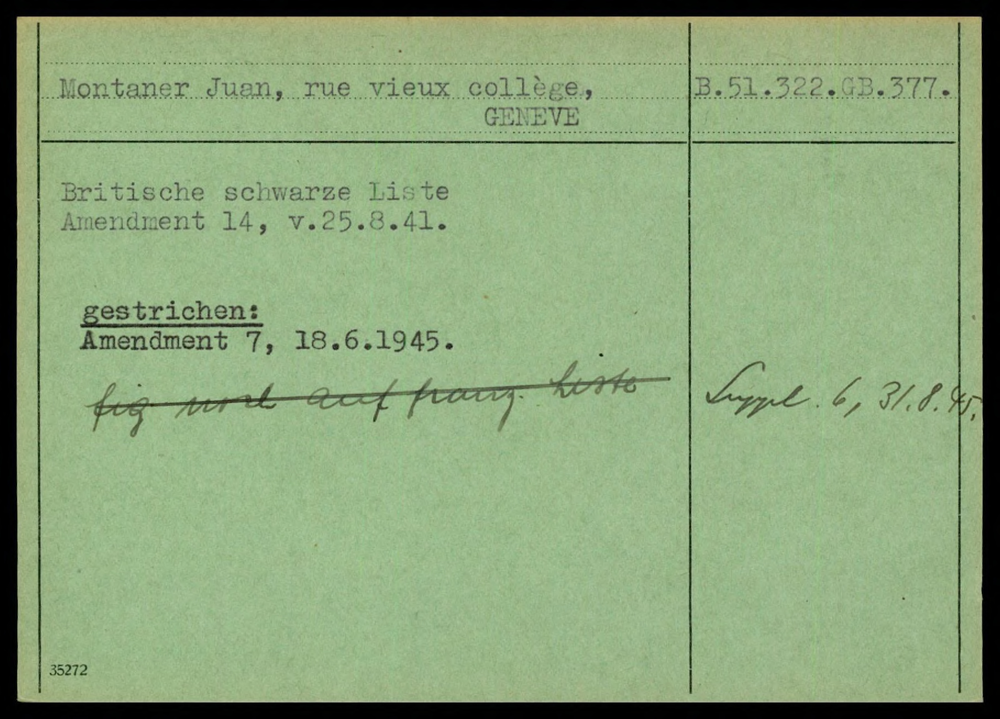

# Blacklist Cards — Optimized Prompt

**Program**: `results/blacklist_cards/optimized/mipro-cot_gemini-2.0-flash_optimized.json`
**Optimizer**: MIPROv2 medium, ChainOfThought
**Model**: Gemini 2.0 Flash
**Result**: fuzzy = 0.9599 (0.9713 with Refine(3))

---

## Instruction

> Extract structured data from a scanned 1940s British blacklist index card. Your goal is to convert the visual information into a structured JSON format. Pay close attention to detail and adhere strictly to the following guidelines:
>
> 1. **Schema Compliance**: The output MUST be a valid JSON object conforming to the defined schema. No extra fields or deviation is allowed.
> 2. **Company & Location**: Extract the 'company' and 'location' from the top-left of the card. These will always have a nested "transcription" field.
> 3. **B ID**: Extract the 'b_id' from the top-right of the card, ensuring it begins with "B.".
> 4. **Date**: The 'date' field should be populated with the stamped date in "YYYY-MM-DD" format. If no date is stamped, use an empty string ("").
> 5. **Information**: The 'information' field is a list of text blocks from the card's body. Each block is a separate object with a "transcription" field. If there are no text blocks in the card body, use an empty list ("").
> 6. **Transcription Accuracy**: Preserve original language, diacritics, and punctuation EXACTLY as written on the card.
> 7. **Line Breaks**: Maintain line breaks within information blocks using "\\n".
> 8. **Missing Values**: If a value is unreadable, use an empty string ("") for its transcription.
> 9. **Reasoning**: Before outputting the JSON, think step by step about your reasoning to ensure accuracy.

## Signature Fields

### Input

**Card Image:** Scanned blacklist index card

### Output

**Reasoning:** Let's think step by step in order to `${reasoning}`

**Document:**

> A JSON object with the extracted data from a 1940s British blacklist index card.
> The JSON must follow this exact schema:
> ```json
> {
>   "company": {"transcription": "string — primary company or person name, top-left of card"},
>   "location": {"transcription": "string — city or town, often following the company name"},
>   "b_id": {"transcription": "string — identifier code, top-right, starting with 'B.'"},
>   "date": "string — stamped date in YYYY-MM-DD format, or empty string if absent",
>   "information": [
>     {"transcription": "string — text block from the card body"}
>   ]
> }
> ```
>
> Rules:
> - company, location, and b_id each have a nested "transcription" field.
> - date is a flat string (no transcription wrapper). Use "" if no date is stamped.
> - information is a list of objects, each with a "transcription" field. Use "" (empty string) if the card body has no text blocks.
> - Preserve line breaks in information blocks with \n.
> - Preserve original language, diacritics, and punctuation exactly as written.
> - If you cannot read a value, use an empty string for its transcription.

## Few-Shot Demonstrations (2)

### Demo 0 (augmented, with bootstrapped reasoning)


*Card for Tabador S.A. in Genève. Added to the British blacklist in Amendment 14 (October 1943), removed in Amendment 3 (February 1945). No date stamp.*

**Reasoning:**

> I have extracted the company name, location, B ID, and information from the card. The date is not stamped, but there is a date in the information section, but I will leave the date field empty.

**Document:**

```json
{
  "b_id": {"transcription": "B.51.322.GB.1155."},
  "company": {"transcription": "Tabador S.A."},
  "date": "",
  "information": [
    {"transcription": "Britische schwarze Liste,\nAmendment 14, Oktober 1943."},
    {"transcription": "gestrichen:\nAmendment 3, Februar 1945."}
  ],
  "location": {"transcription": "Genève"}
}
```

### Demo 1 (ground truth, no reasoning)



*Card for Montaner Juan at rue vieux collège, GENEVE. Added in Amendment 14 (25.8.41), removed in Amendment 7 (18.6.1945). Date stamp: 1945-06-18. Contains handwritten note about the French list.*

**Document:**

```json
{
  "b_id": {"transcription": "B.51.322.GB.377."},
  "company": {"transcription": "Montaner Juan"},
  "date": "1945-06-18",
  "information": [
    {"transcription": "Britische schwarze Liste\nAmendment 14, v.25.8.41."},
    {"transcription": "gestrichen:\nAmendment 7, 18.6.1945."},
    {"transcription": "fig wird auf franz. liste Suppl. 6, 31.8.45,"},
    {"transcription": "rue vieux collège"}
  ],
  "location": {"transcription": "GENEVE"}
}
```

*(Images resized from originals for web viewing. Full-resolution scans are in `data/blacklist_cards/images/`.)*

## Insights

The instruction is notably long (9 numbered guidelines) compared to other benchmarks — Library Cards got a 5-sentence instruction, Business Letters got 2 sentences, and Personnel Cards got a persona-framed paragraph. This is the longest instruction MIPROv2 has generated across all five benchmarks, despite Blacklist Cards having the simplest schema (5 fields, flat structure). The length comes from the optimizer discovering that explicit formatting rules (date format, line break handling, empty-string conventions) are important for this benchmark's fuzzy scoring, where every character-level discrepancy reduces the score.

The `date` field handling is the trickiest extraction decision. Demo 0 shows the correct approach: dates mentioned *within* information blocks (like "Oktober 1943" and "Februar 1945") are NOT used for the `date` field — only a stamped date on the card counts. The bootstrapped reasoning explicitly calls this out: "The date is not stamped, but there is a date in the information section, but I will leave the date field empty." This distinction between stamped dates and mentioned dates is a subtlety that MIPROv2's demo selection surfaced — without it, the model might populate the date field from textual dates in the information blocks.

The two demos cover the two main card variants: Demo 0 has no date stamp (date = ""), while Demo 1 has a date stamp ("1945-06-18"). Demo 1 also shows a more complex card with a handwritten annotation and a partial address ("rue vieux collège") that must be captured as a separate information block. This pair efficiently covers the main structural variation in the dataset without requiring more demos.

Unlike Library Cards (where the instruction was generic and demos did the heavy lifting) or Bibliographic Data (where the instruction embedded the full schema twice), Blacklist Cards hits a middle ground: the instruction provides detailed extraction rules while the demos illustrate the two main structural variants. This suggests MIPROv2 adapts its instruction-demo balance based on the diversity of the task — simple schemas with few structural variants get longer instructions, while diverse schemas with many card types rely more on demos.
