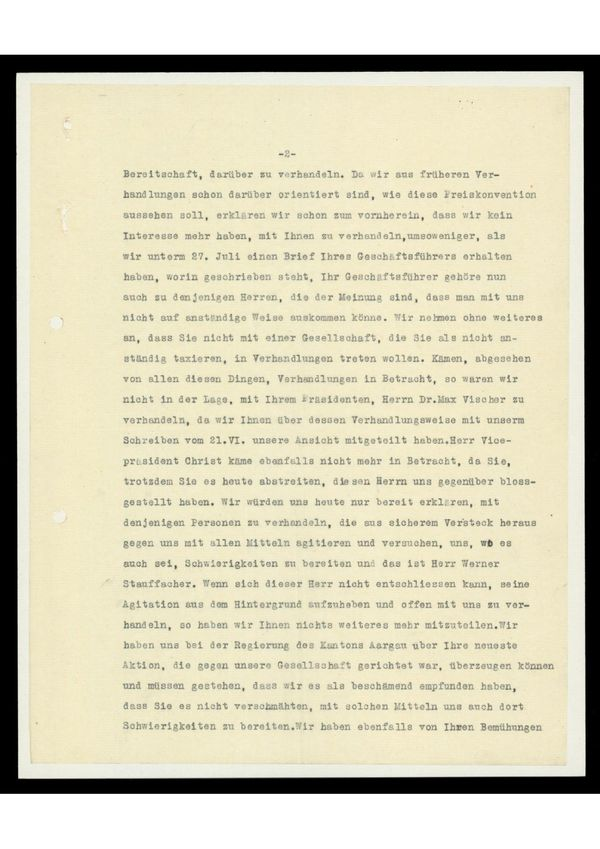
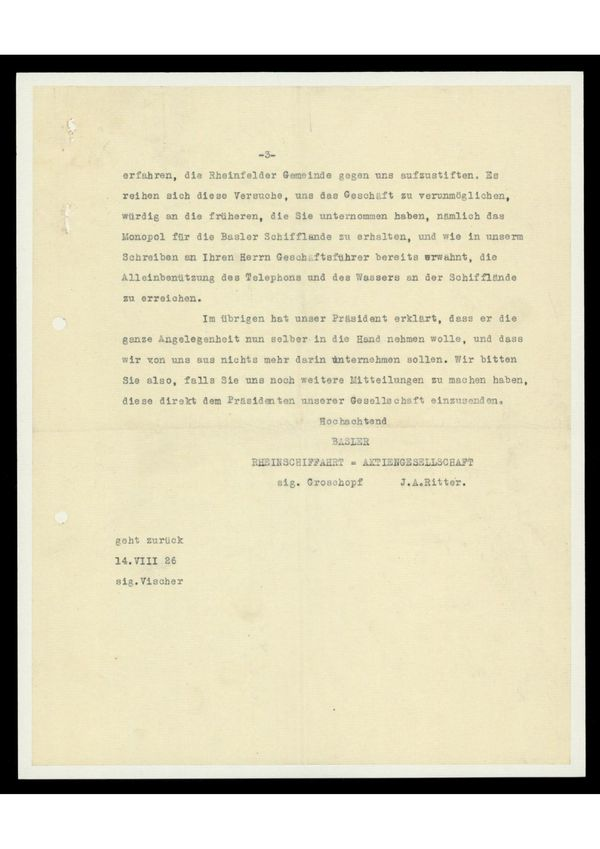
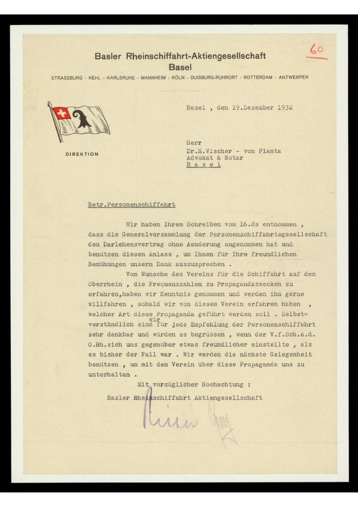

# Business Letters — Optimized Prompt

**Program**: `results/business_letters/optimized/mipro-cot_gemini-2.0-flash_optimized.json`
**Optimizer**: MIPROv2 medium, ChainOfThought
**Model**: Gemini 2.0 Flash
**Result**: f1_macro = 0.6378

---

## Instruction

> You are a highly skilled archivist specializing in extracting metadata from historical documents. Your task is to extract structured metadata from a series of scanned historical letter page images.

## Signature Fields

### Input

**Page Images:** Scanned page images of a historical letter (one or more pages)

### Output

**Reasoning:** Let's think step by step in order to `${reasoning}`

**Document:**

> A JSON object with the extracted metadata from the letter images.
> The JSON must follow this exact schema:
> ```json
> {
>   "letter_title": ["string or null"],
>   "send_date": ["YYYY-MM-DD"],
>   "sender_persons": ["First Last"],
>   "receiver_persons": ["First Last"],
>   "has_signatures": "TRUE" or "FALSE"
> }
> ```
>
> Rules:
> - All values for letter_title, send_date, sender_persons, and receiver_persons
>   must be lists, even if there is only a single value.
> - Use ISO format YYYY-MM-DD for dates.
> - Write person names as they appear in the letter, in "First Last" order
>   (e.g. "Werner Stauffacher", "Dr. Max Vischer", "Fritz Ritter").
>   Include titles and honorifics only when they appear as part of the name.
>   Do NOT use "Last, First" format.
> - If a piece of information is not found in the letter, set the value to ["null"].
> - has_signatures: "TRUE" if the letter contains handwritten signatures, "FALSE" otherwise.
> - Do not return anything except the JSON object.

## Few-Shot Demonstrations (2)

### Demo 0 (augmented, with bootstrapped reasoning)

| Page 1 | Page 2 | Page 3 |
|--------|--------|--------|
|  |  |  |

*3-page letter from Basler Rheinschiffahrt-Aktiengesellschaft to Dr. Max Vischer, dated August 13, 1926, regarding the use of landing stages.*

**Reasoning:**

> The letter is from Basler Rheinschiffahrt-Aktiengesellschaft, dated August 13, 1926. The subject is the use of landing stages. The letter is addressed to Dr. Max Vischer. The letter is signed by Groschupf and J.A. Ritter. The letter mentions Werner Stauffacher.

**Document:**

```json
{
  "letter_title": ["betreffend Benutzung der Landungsstege"],
  "send_date": ["1926-08-13"],
  "sender_persons": ["Groschupf", "J.A. Ritter"],
  "receiver_persons": ["Dr. Max Vischer"],
  "has_signatures": "TRUE"
}
```

### Demo 1 (ground truth, no reasoning)



**Document:**

```json
{
  "letter_title": ["Betr. Personenschiffahrt"],
  "send_date": ["1932-12-19"],
  "sender_persons": ["Ritter-Dreier, Fritz", "Groschupf-Jaeger, Louis"],
  "receiver_persons": ["Vischer-von Planta, Max"],
  "has_signatures": "TRUE"
}
```

*(Images resized from originals for web viewing. Full-resolution scans are in `data/business_letters/images/`.)*

## Insights

The "First Last" name format rule in the Document field description is the single highest-impact prompt element in the entire project. The upstream benchmark's `persons.json` alias table contains 119 entries — all in "First Last" format, zero in "Last, First". Because scoring uses exact string match with no fuzzy tolerance or name normalization, any name not matching an alias scores zero. Before adding explicit "First Last" format guidance, the predict baseline scored only 0.2721 f1_macro; the prompt change alone gave a +18 point lift to 0.4565 before any optimization was applied.

An interesting tension is visible in the two demos. Demo 0 (augmented, used during optimization) shows names in "First Last" format: "Groschupf", "J.A. Ritter", "Dr. Max Vischer". Demo 1 (ground truth from the training data) shows names in "Last-Maiden, First" format: "Ritter-Dreier, Fritz", "Groschupf-Jaeger, Louis", "Vischer-von Planta, Max". The ground truth uses the full hyphenated married names that appear in the alias table, while the augmented demo uses the shorter forms that also appear. Both formats exist in `persons.json` — the model needs to learn from the demos which format variants the alias table accepts, rather than following a single rigid pattern.

The bootstrapped reasoning in Demo 0 is notably brief compared to Library Cards: just a summary of who, what, when. For entity extraction tasks, the model's reasoning is more like "I see these names" than a chain of deductive steps. This suggests that CoT's value for Business Letters is less about reasoning quality and more about giving MIPROv2 an additional parameter to optimize over — the reasoning field creates space for the optimizer to shape how the model approaches the task.
