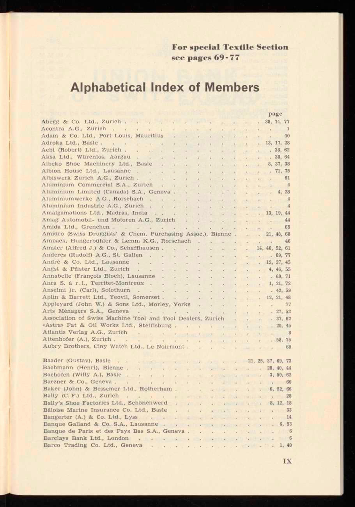
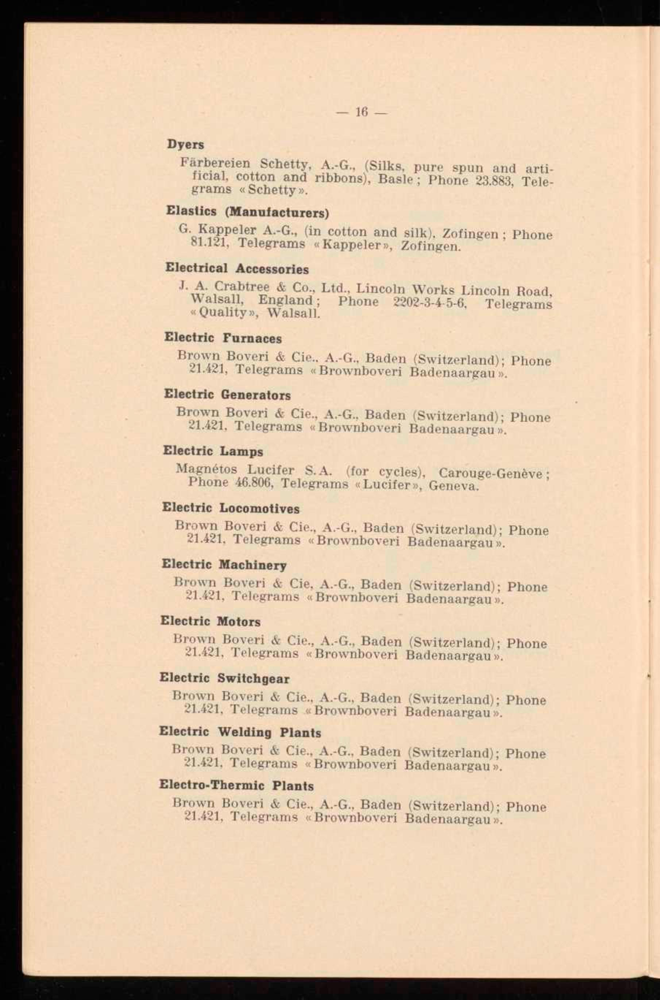

# Company Lists — Optimized Prompt

**Program**: `results/company_lists/optimized/mipro-cot_gemini-2.0-flash_optimized.json`
**Optimizer**: MIPROv2 medium, ChainOfThought
**Model**: Gemini 2.0 Flash
**Result**: f1_macro = 0.8771

---

## Instruction

> You are an expert archivist specializing in historical trade directories. Extract structured company data from the scanned page of a historical trade index. Your goal is to accurately identify company names and their locations. Pay close attention to detail, preserving original language, diacritics, and punctuation exactly as written. Distinguish between alphabetical and thematic listings, and remember that headings and page numbers are not part of the data.

## Signature Fields

### Input

**Page Image:** Scanned page from a company trade index

**Page Id:** Page identifier used for generating entry IDs

### Output

**Reasoning:** Let's think step by step in order to `${reasoning}`

**Document:**

> A JSON object with structured data extracted from a scanned page of a company trade index.
> The JSON must follow this exact schema:
> ```json
> {
>   "page_id": "string — the page identifier, provided as input",
>   "entries": [
>     {
>       "entry_id": "string — unique identifier in the format '{page_id}-N' where N is the sequential entry number starting at 1",
>       "company_name": "string — the name of the company or person",
>       "location": "string — the location of the company, e.g. 'Zurich' or 'London, UK'. Use the string 'null' (not JSON null) if no location is given"
>     }
>   ]
> }
> ```
>
> About the source:
> - The image stems from a trade index of the British Swiss Chamber of Commerce (1925-1958).
> - Pages can show an alphabetical or a thematic list of companies.
> - Companies are mostly located in Switzerland and the UK.
> - Most pages have one column but some years have two columns.
> - The source is in English and German but company names can be in English, German, French or Italian.
>
> About the entries:
> - Each entry describes a single company or person.
> - Alphabetical entries have filling dots between the company name and a page number. Dots and page numbers are NOT part of the data — ignore them.
> - Alphabetical entries seldom to never have locations.
> - Thematic entries often have locations.
> - Thematic entries are listed under headings that describe the type of business. Headings are NOT entries — do not extract them.
> - Some thematic headings are only references to other headings, e.g. "X, s. Y". These are NOT entries.
> - Do not add country information unless it is directly written with the location.
> - Preserve original language, diacritics, and punctuation exactly as written.

## Few-Shot Demonstrations (2)

### Demo 0 (augmented, with bootstrapped reasoning)



*46 entries in alphabetical order. Each company name is followed by filling dots and a page number (to be ignored). Most entries have locations — Swiss and UK cities.*

**Reasoning:**

> The image shows an alphabetical index of members. I will extract the company names and locations, creating a unique entry ID for each. I will use "null" for locations that are not provided.

**Document** (46 entries, truncated — first 5 and last 2 shown):

```json
{
  "page_id": "156089_1321099_11",
  "entries": [
    {
      "entry_id": "156089_1321099_11-1",
      "company_name": "Abegg & Co. Ltd.",
      "location": "Zurich"
    },
    {
      "entry_id": "156089_1321099_11-2",
      "company_name": "Acontra A.G.",
      "location": "Zurich"
    },
    {
      "entry_id": "156089_1321099_11-3",
      "company_name": "Adam & Co. Ltd.",
      "location": "Port Louis, Mauritius"
    },
    {
      "entry_id": "156089_1321099_11-4",
      "company_name": "Adroka Ltd.",
      "location": "Basle"
    },
    {
      "entry_id": "156089_1321099_11-5",
      "company_name": "Aebi (Robert) Ltd.",
      "location": "Zurich"
    },
    "... 39 more entries ...",
    {
      "entry_id": "156089_1321099_11-45",
      "company_name": "Barclays Bank Ltd.",
      "location": "London"
    },
    {
      "entry_id": "156089_1321099_11-46",
      "company_name": "Barco Trading Co. Ltd.",
      "location": "Geneva"
    }
  ]
}
```

### Demo 1 (ground truth, no reasoning)



*12 entries grouped under trade headings (Dyeing, Electrical Engineering, etc.). Headings are NOT extracted. Brown Boveri & Cie. appears multiple times under different headings.*

**Document:**

```json
{
  "page_id": "156089_1321092_18",
  "entries": [
    {"entry_id": "156089_1321092_18-1", "company_name": "Färbereien Schetty, A.-G.", "location": "Basle"},
    {"entry_id": "156089_1321092_18-2", "company_name": "G. Kappeler A.-G.", "location": "Zofingen"},
    {"entry_id": "156089_1321092_18-3", "company_name": "J. A. Crabtree & Co., Ltd.", "location": "Walsall, England"},
    {"entry_id": "156089_1321092_18-4", "company_name": "Brown Boveri & Cie., A.-G.", "location": "Baden (Switzerland)"},
    {"entry_id": "156089_1321092_18-5", "company_name": "Brown Boveri & Cie., A.-G.", "location": "Baden (Switzerland)"},
    {"entry_id": "156089_1321092_18-6", "company_name": "Magnétos Lucifer S. A.", "location": "Carouge-Genève"},
    {"entry_id": "156089_1321092_18-7", "company_name": "Brown Boveri & Cie., A.-G.", "location": "Baden (Switzerland)"},
    {"entry_id": "156089_1321092_18-8", "company_name": "Brown Boveri & Cie., A.-G.", "location": "Baden (Switzerland)"},
    {"entry_id": "156089_1321092_18-9", "company_name": "Brown Boveri & Cie., A.-G.", "location": "Baden (Switzerland)"},
    {"entry_id": "156089_1321092_18-10", "company_name": "Brown Boveri & Cie., A.-G.", "location": "Baden (Switzerland)"},
    {"entry_id": "156089_1321092_18-11", "company_name": "Brown Boveri & Cie., A.-G.", "location": "Baden (Switzerland)"},
    {"entry_id": "156089_1321092_18-12", "company_name": "Brown Boveri & Cie., A.-G.", "location": "Baden (Switzerland)"}
  ]
}
```

*(Images resized from originals for web viewing. Full-resolution scans are in `data/company_lists/images/`.)*

## Insights

This is the only benchmark with **two input fields** — `page_image` and `page_id`. The model needs the page ID as explicit input to generate correct entry IDs in the `"{page_id}-N"` format. Without it, the model would invent IDs, losing ~1/3 of true positives (one `entry_id` per 3 scored fields per entry). This likely explains the gap between our baseline (76.4 f1_macro) and the upstream leaderboard's best score (GPT-5: 58.4).

The instruction uses the same persona framing as Personnel Cards ("You are an expert archivist") and Business Letters ("You are a highly skilled archivist"). At 4 sentences, it sits between the extremes — longer than Business Letters (2 sentences) but far shorter than Bibliographic Data's 40-line schema embedding. As in other benchmarks, the Document field description carries the detailed extraction rules: 12 rules split into "About the source" (5 context rules) and "About the entries" (7 extraction rules). The rules focus on what NOT to extract — headings, page numbers, filling dots, cross-reference headings — which is more important than what to extract for this task.

The two demos partition the input space cleanly: Demo 0 is an **alphabetical** index (46 entries, filling dots to ignore), Demo 1 is a **thematic** listing (12 entries under trade headings that must not be extracted). Demo 0's reasoning teaches the `"null"` string convention for missing locations, while Demo 1 implicitly teaches that duplicate companies (Brown Boveri appears 8 times under different headings) must each be extracted as separate entries.
