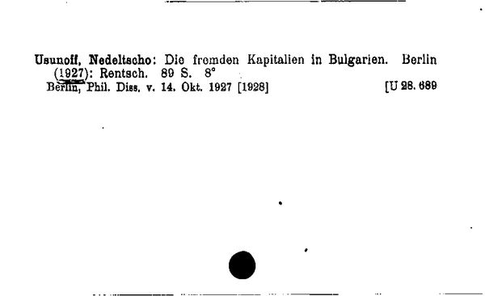
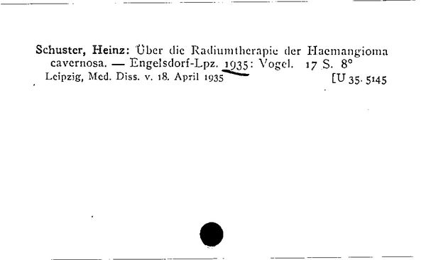

# Library Cards — Optimized Prompt

**Program**: `results/library_cards/optimized/mipro-cot_gemini-2.0-flash_optimized.json`
**Optimizer**: MIPROv2 medium, ChainOfThought
**Model**: Gemini 2.0 Flash
**Result**: f1_macro = 0.9017

---

## Instruction

> Analyze the scanned image of the Swiss library catalog card and extract the bibliographic data. Provide the extracted data as a JSON object following the schema specified in the Document field description. Focus on accurately identifying the 'type' (Dissertation or thesis/Reference), author, publication details, and library reference information. Pay special attention to nuances such as German titles, variations in 'format', and classification codes in 'subjects'. Use 'null' for missing optional fields.

## Signature Fields

### Input

**Card Image:** Scanned image of a library catalog card

### Output

**Reasoning:** Let's think step by step in order to `${reasoning}`

**Document:**

> A JSON object with the extracted bibliographic data from the library card image.
> The JSON must follow this exact schema:
> ```json
> {
>   "type": {"type": "Dissertation or thesis" OR "Reference"},
>   "author": {"last_name": "string", "first_name": "string"},
>   "publication": {
>     "title": "string",
>     "year": "string",
>     "place": "string or null",
>     "pages": "string or null",
>     "publisher": "string or null",
>     "format": "string or null",
>     "editor": "string or null"
>   },
>   "library_reference": {
>     "shelfmark": "string or null",
>     "subjects": "string or null"
>   }
> }
> ```
>
> Rules:
> - If the card contains "s." on a separate line, type is "Reference"; otherwise "Dissertation or thesis".
> - Use null for missing optional fields.
> - Remove " S." suffix from pages values.
> - Format is usually "8°", "8'" or "4°".
> - Shelfmark often begins with "Diss." or "AT".

## Few-Shot Demonstrations (2)

### Demo 0 (augmented, with bootstrapped reasoning)



**Reasoning:**

> The card contains "S." on the same line as the page number, so the type is "Dissertation or thesis". The author's last name is "Usunoff" and first name is "Nedeltscho". The title is "Die fremden Kapitalien in Bulgarien". The year is 1927. The place is Berlin. The pages are 89. The publisher is Rentsch. The format is 8°. The shelfmark is U 28. 689.

**Document:**

```json
{
  "type": {"type": "Dissertation or thesis"},
  "author": {"last_name": "Usunoff", "first_name": "Nedeltscho"},
  "publication": {
    "title": "Die fremden Kapitalien in Bulgarien",
    "year": 1927,
    "place": "Berlin",
    "pages": "89",
    "publisher": "Rentsch",
    "format": "8°"
  },
  "library_reference": {
    "shelfmark": "U 28. 689",
    "subjects": null
  }
}
```

### Demo 1 (ground truth, no reasoning)



**Document:**

```json
{
  "type": {"type": "Dissertation or thesis"},
  "author": {"last_name": "Schuster", "first_name": "Heinz"},
  "publication": {
    "title": "Über die Radiumtherapie der Haemangioma cavernosa",
    "year": 1935,
    "place": "Engelsdorf-Lpz.",
    "pages": "17",
    "publisher": "Vogel",
    "format": "8°"
  },
  "library_reference": {
    "shelfmark": "U 35. 5145",
    "subjects": ""
  }
}
```

*(Images resized from originals for web viewing. Full-resolution scans are in `data/library_cards/images/`.)*

## Insights

The Library Cards instruction is the most concise of the four benchmarks — just two sentences of guidance plus a "use null" reminder. MIPROv2's Bayesian search found that with 2 well-chosen demonstrations, verbose instructions are unnecessary: the worked examples implicitly teach the extraction schema more effectively than explicit field-by-field rules.

The augmented demo (Demo 0) shows detailed step-by-step reasoning that walks through each field extraction decision. This is the highest-quality bootstrapped reasoning across all four benchmarks — the model could clearly articulate *why* each field was extracted the way it was. The reasoning explicitly addresses the type classification rule ("S." on the same line → "Dissertation or thesis"), which is one of the trickiest extraction decisions.

Demo 1 is a raw ground truth example without reasoning. The mix of one augmented + one raw demo is typical of MIPROv2's demo selection strategy: the augmented demo teaches the reasoning process, while the raw demo provides an additional schema-conforming example without adding the cost of a reasoning trace.
