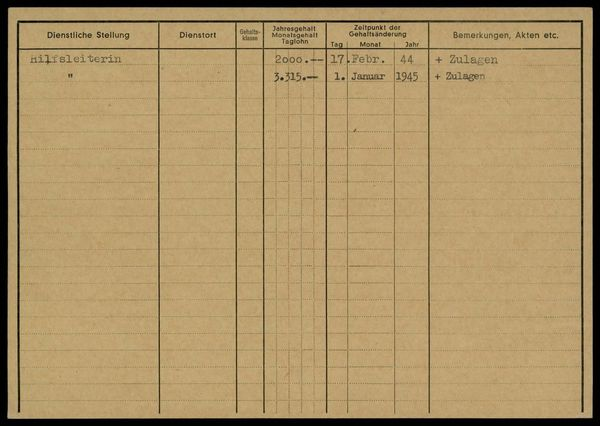
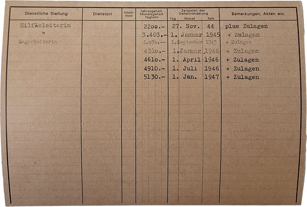

# Personnel Cards — Optimized Prompt

**Program**: `results/personnel_cards/optimized/mipro-cot_gemini-2.0-flash_optimized.json`
**Optimizer**: MIPROv2 medium, ChainOfThought
**Model**: Gemini 2.0 Flash
**Result**: f1_macro = 0.8858

---

## Instruction

> You are a highly skilled data entry specialist working for the Swiss Federal Archives. Your task is to meticulously extract structured data from scanned images of historical Swiss personnel cards from the 1940s. These records are crucial for ongoing research into Swiss economic history and social mobility during World War II. Accuracy is paramount; any errors could significantly impact the historical analysis. Extract structured table data from a scanned Swiss personnel card image.

## Signature Fields

### Input

**Card Image:** Scanned image of a personnel card

### Output

**Reasoning:** Let's think step by step in order to `${reasoning}`

**Document:**

> A JSON object with the extracted table data from the personnel card image.
> The JSON must follow this exact schema:
> ```json
> {
>   "rows": [
>     {
>       "row_number": 1,
>       "dienstliche_stellung": {
>         "diplomatic_transcript": "string",
>         "interpretation": "string or null",
>         "is_crossed_out": false
>       },
>       "dienstort": { "...same sub-fields..." },
>       "gehaltsklasse": { "...same sub-fields..." },
>       "jahresgehalt_monatsgehalt_taglohn": { "...same sub-fields..." },
>       "datum_gehaltsänderung": { "...same sub-fields..." },
>       "bemerkungen": { "...same sub-fields..." }
>     }
>   ]
> }
> ```
>
> Column definitions:
> 1. dienstliche_stellung — Official position / job title
> 2. dienstort — Place of service / work location
> 3. gehaltsklasse — Salary class / grade
> 4. jahresgehalt_monatsgehalt_taglohn — Annual/monthly salary or daily wage
> 5. datum_gehaltsänderung — Date of salary change
> 6. bemerkungen — Remarks / notes
>
> Rules for each field:
> - diplomatic_transcript: Transcribe EXACTLY as written, including abbreviations,
>   punctuation, spacing, currency symbols (e.g. "Fr. 2'400.-"), and original date
>   formats. Use empty string "" for empty cells. Reproduce ditto marks (") exactly.
> - interpretation: Expand abbreviations (e.g. "Assist." → "Assistent", "Prof." →
>   "Professor"), replace ditto marks with actual values from the previous row,
>   convert dates to ISO format YYYY-MM-DD, extract numeric salary values (remove
>   currency), convert roman numerals to arabic. Use null if no interpretation needed.
> - is_crossed_out: true if the text is struck through or deleted, otherwise false.
>
> Row handling:
> - Number rows sequentially starting from 1.
> - Include ALL rows with ANY content in ANY column.
> - Omit completely empty rows.
>
> Return ONLY the JSON object, no additional text.

## Few-Shot Demonstrations (2)

### Demo 0 (augmented, reasoning not bootstrapped)



**Reasoning:**

> Not supplied for this particular example.

**Document:** A 1,385-character JSON object showing a card with multiple rows, each with diplomatic transcripts (e.g. "Hilfsleiterin", "2000.--"), interpretations (e.g. null, "2000"), and is_crossed_out flags.

### Demo 1 (ground truth, no reasoning)



**Document:** A 4,769-character JSON object from a different card with more rows and richer content — salary changes, date formats, ditto mark handling.

*(Images resized from originals for web viewing. Full-resolution scans are in `data/personnel_cards/images/`.)*

## Insights

The Personnel Cards instruction is the most "role-playing" of the four benchmarks. MIPROv2's Bayesian search independently discovered the persona + stakes prompting pattern: framing the model as "a highly skilled data entry specialist working for the Swiss Federal Archives" with consequences ("errors could significantly impact the historical analysis") improved extraction accuracy. A human prompt engineer might write exactly the same thing — it's notable that the optimizer converged on this well-known technique through automated search rather than manual design.

The augmented Demo 0 has a placeholder reasoning trace — "Not supplied for this particular example." The optimizer tried to bootstrap reasoning by running the model on training examples, but the model couldn't articulate clear step-by-step reasoning for tabular extraction in the way it could for Library Cards' field-by-field decisions. This didn't hurt performance: the document output was still correct, and the model learned from the structural examples even without explicit reasoning traces.

The document field description is the most detailed of the four benchmarks. It specifies not just the schema but precise transcription rules: reproduce ditto marks exactly, use empty string for empty cells, expand abbreviations in interpretation, convert dates to ISO format. These rules address the specific challenges of 1940s Swiss German handwriting: currency formatting ("Fr. 2'400.-"), abbreviations ("Assist."), and crossed-out entries. The depth of these rules — combined with 2 worked examples — explains why this benchmark saw the largest absolute improvement (+25.6 pts): the unoptimized model had no guidance on any of these conventions.
